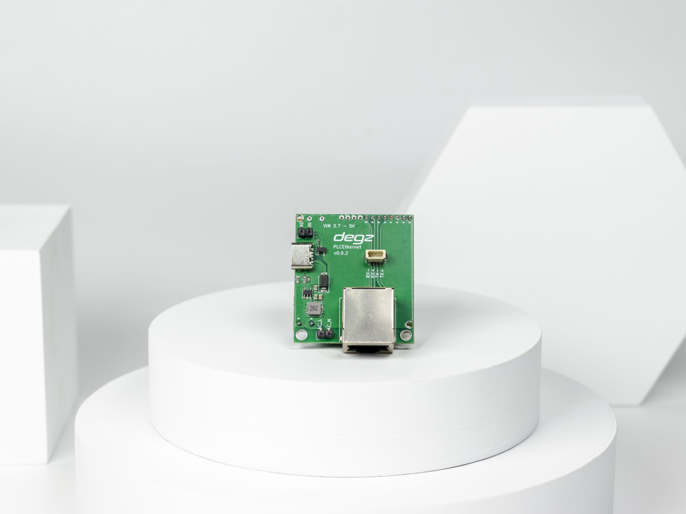

import DocCardList from '@theme/DocCardList';

# Ürün Hakkında

Sublink Hi-com, kompakt boyutlarda (43×38 mm) ve düşük enerji tüketimi ile tasarlanmış bir iletişim modülüdür. Bu modül, iki tel üzerinden 300 metreye kadar yüksek hızda (200 Mbps) ethernet iletişimi yapabilme kapasitesine sahiptir. Ethernet protokolünü kullanarak, AC_L ve AC_N tellerini bağlayarak hızlı ve kolay bir şekilde iletişime geçilebilen bu cihaz, saatte 3.3 watt gibi düşük bir güç tüketimiyle uzun süreli batarya performansı sunar. Sualtı araçları için özel olarak test edilmiş ve optimize edilmiş olan Sublink Hi-com, su altı projelerinde güvenilir iletişim sağlamak için geliştirilmiştir. Modül, TCP/IP, IGMP, CSMA/CA, QoS gibi standart internet protokollerini destekler ve AES 128 bit şifreleme ile güvenli bir veri iletimi sunar.

# Ürünün Teknik Özellikleri

| Özellik                            | Değer                         |
|------------------------------------|-------------------------------|
| Menzil (En yüksek hız için)        | 300 metre                     |
| Bağlantı Hızı                      | 200 Mbps                      |
| Besleme Voltajı                    | 3.7V – 5V                     |
| USB Güç Besleme                    | Mevcut                        |
| Güç Tüketimi                       | 3.3Watt/Saat                  |
| Boyutlar MM (En x Boy x Yükseklik) | 43x38x32                      |
| Bağlantı Tipi                      | RJ45 veya (Ethernet) 4pin JST |
| Çalışma Sıcaklığı                  | 0-70 C°                       |
| Ağırlık                            | 30 gram                       |
| İletişim Standardı                 | IEEE 802.3                    |
| Güvenlik                           | AES 128 Bit Şifreleme         |
| Protokol                           | TCP/IP, IGMP, CSMA/CA, QoS    |
| Modülasyon Tipi                    | OFDM                          |
| Sublink Hi-com Usb Uyumluluk       | Tam uyumlu                    |
| Sublink Lo-com ile Uyumluluk       | Uyumlu Değil                  |

Bu ürünü almak için [tıklayınız](https://degzrobotics.com/product/sublink-hi-com-yuksek-hizli-iletisim-modulu/).  

<DocCardList />

