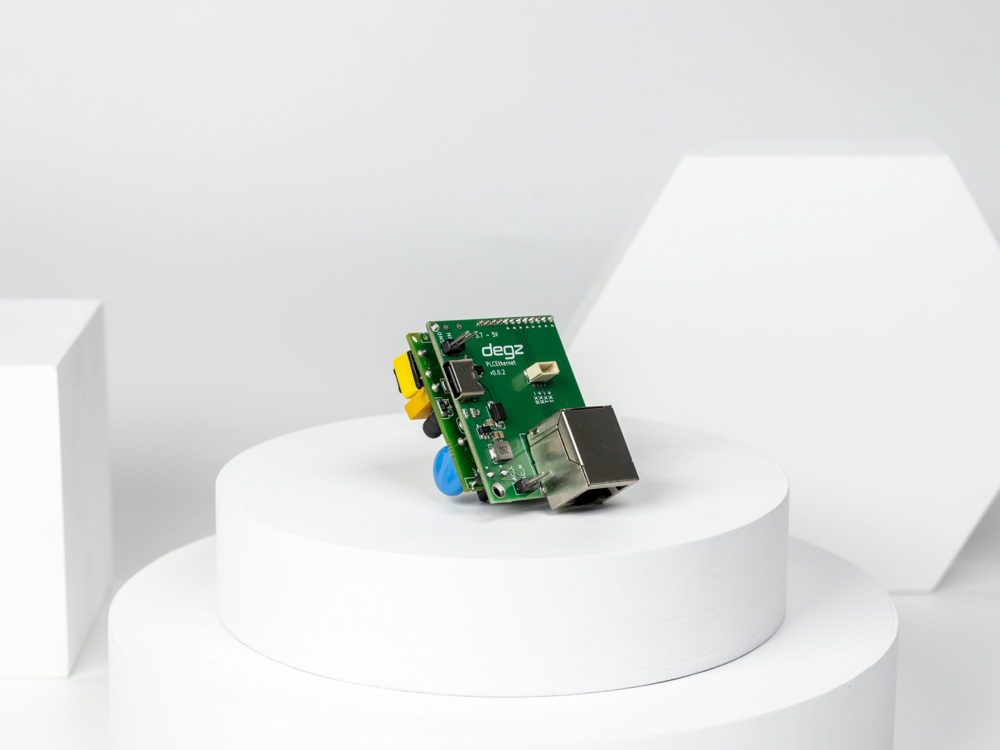

import DocCardList from '@theme/DocCardList';

# Ürün Hakkında

Sublink Hi-com ile iletişimde kolaylık ve hızı keşfedin! Küçük boyutları (43×38 mm), ürünlerinizde minimum yer kaplamak için idealdir ve küçük cihazlar için mükemmel bir çözümdür.

İletişim modülü, sadece 2 kablo üzerinden 300 metreye kadar yüksek hızda ethernet iletişimi sağlar. AC_L ve AC_N kablosunu bağlayarak hemen iletişime geçebilir ve standart bir ethernet bağlantısı kurabilirsiniz. Düşük enerji tüketimi ile saatlik 3.3W ile bataryalı sistemlerde uzun kullanım süresi sunar. Sublink Hi-com, sualtı araçlarında test edilmiş ve geliştirilmiş bir iletişim modülüdür, bu sayede su altı projelerinizde güvenilir performans elde edebilirsiniz.

## Kolay kullanım

Sublink Hi-com iki kabloyu (AC_L ve AC_N) karşılıklı bağlayıp güç verdiğiniz anda iletişime hazır hale gelir. Bu basit bağlantı standart bir ethernet bağlantısını simüle eder. Standart ethernet çıkışlarından uyumlu herhangi cihaza direkt bağlantı sağlayabilirsiniz.

## Küçük alanlar için uygun

43×38 mm boyutları ile ürünlerinizde minimum yer kaplar ve küçük boyutlu cihazlar için tam bir biçilmiş kaftan!

## Yüksek hız için yalnız 2 kablo

Sublink Hi-com iletişim modülü 2 kablo üzerinden yüksek hızda ethernet iletişimi kurulması için geliştirilmiş iletişim modülüdür. Standart ethernet iletişim protokolünü, 2 kablo üzerinden 300 metre mesafeye kadar iletebilir.

## Düşük enerji tüketimi

Saatlik 3.3W düşük güç tüketimi ile bataryalı sistemlerde yüksek kullanım süresi sağlar. İletişim modülünü standart bir USB modülü üzerinden rahatlıkla besleyebilirsiniz.

## Sualtı araçlarında kullanıma hazır

Sublink Hi-com yüksen hızlı modülü insansız sualtı araçları üzerinde test edilmiş ve geliştirilmiştir. Örnek kullanım aşağıdaki gibidir.

<DocCardList />

