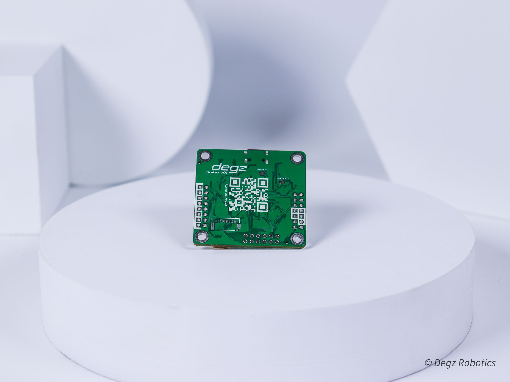
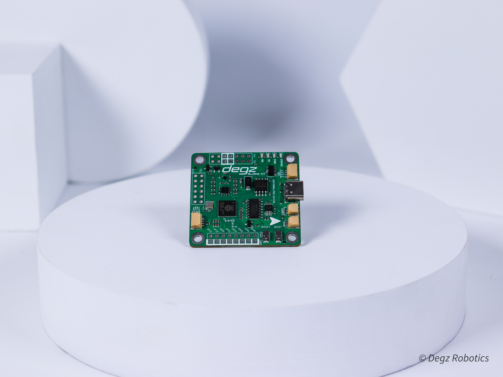

import DocCardList from '@theme/DocCardList';

# Ürün Hakkında

## Suibo dalışa hazır

Suibo su altı kontrol kartı, su altı teknoloji projeleriniz için özel olarak tasarlanmış, gelişmiş bir geliştirme kartıdır.  Bu yenilikçi kart,insansız su altı sistemleriniz için zengin özelliklere sahip derindriver yazılım ve arayüz ile birlikte verilecektir . 

Deringezen-X ile uyumlu olan Suibo geliştirme kartı, boyutlarıyla dikkat çekerken, FPV stack geleneğini sürdürerek ek kartlarla projelerinize uyum sağlar. Suibo , esneklik ve performansı bir arada sunarak, 8 motoru eş zamanlı kontrol edebilme yeteneği ve çeşitli iletişim protokollerini destekleme özelliği ile öne çıkar.

Otonomi ve hassas kontrol için gerekli olan 10 eksen dengeleme özelliği ile donatılmış Suibo, jiroskop, ivmeölçer, pusula  gibi sensörlerle zenginleştirilmiştir. Bu sensörler, insansız su altı araçlarından roket kontrol sistemlerine kadar geniş bir kullanım alanı sağlar. Teknik açıdan zengin özelliklere sahip olan Suibo , çift çekirdekli ARM M0 mikrodenetleyici, 8 Mb harici flash bellek, IMU sensörü ve programlanabilir LED'ler gibi donanımlarla donatılmıştır. 

 Bu yenilikçi kart,insansız su altı sistemleriniz için zengin özelliklere sahip derindriver yazılım ve arayüz ile birlikte verilecektir . 

Deringezen-1, Suibo ile çalışmaktadır.

## Değişen tasarımla daha uyumlu ve güçlü

45x45mm boyutları ile en küçük projelerde dahi işinizi kolaylaştıracak. FPV stack geleneğinin sürdürüldüğü Suibo, ek kartlar ile tüm projelere uyumluluk sağlayabilir.
Teknik olarak , Suibo 3.3V ile 6V arasında bir besleme gerilimi sağlayarak, projelerinizin güç ihtiyacını esnek bir şekilde karşılar. Projenizin bağlantı gereksinimlerine uyum sağlayabilmek için dört adet I2C uyumlu JST bağlantısı vardır.Bir UART ve bir RS485 uyumlu JST bağlantısı  ayrıca, base kartıyla entegrasyonu kolaylaştıracak bir JST bağlantısı da mevcuttur. Bu geniş bağlantı yelpazesi, projelerinize gereken çeşitliliği ve adaptasyon kabiliyetini sağlar. Programlama ve sıfırlama işlemleri için ise kullanıcı dostu boot ve reset tuşları bulunur, bu da geliştirme sürecini daha da kolaylaştırır.

## Farklı projeler için esnek hale getirildi

Suibo ile 8 motoru aynı anda kontrol edebilirsiniz. I2c, SPI, UART ve bir çok farklı iletişim tipini desteklemektedir. Arduino projelerinde kullanılan tüm sensörleri Suibo’ya rahatlıkla entegre edebilirsiniz.

## 10 eksen dengeleme

Suibo’nun üzerindeki jiroskop, ivmeölçer, pusula sensörü ile yarı otonom ve otonom araç projelerinizde rahatlıkla kullanabilirsiniz.

## Otonomi için gerekli tüm sensörler üzerinde

Suibo  tüm robotik projelerinizde kullanabileceğiniz kontrol kartıdır. Robotik projeler için gerekli jiroskop, ivmeölçer, pusula  sensörü gibi gerekli tüm sensörleri içerisinde barındırmaktadır. Bu sensörlerle birlikte Suibo’yu;

- İnsansız Su Altı Aracı Kontrol Kartı
- İnsansız Hava Aracı Kontrol Kartı
- İnsansız Su Üstü Aracı Kontrol Kartı
- Roket Kontrol Kartı olarak kullanabilirsiniz!

<DocCardList />
