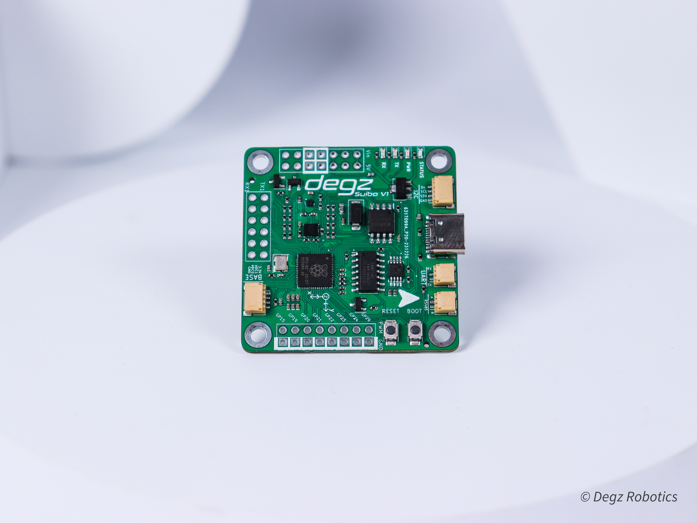

import DocCardList from '@theme/DocCardList';

# Ürün Hakkında

## Suibo dalışa hazır

Suibo, çeşitli robotik ve otomasyon projelerinde kullanılmak üzere tasarlanmış gelişmiş bir kontrol kartıdır. Bu kart, otonomi ve hassas kontrol ihtiyaçları için 9 eksenli dengeleme özelliğine sahip olup, jiroskop, ivmeölçer ve pusula sensörleri gibi önemli sensörleri içermektedir. Çift çekirdekli ARM M0 mikrodenetleyici, 8 MB harici flash bellek, IMU sensörü ve programlanabilir LED'ler ile kullanılabilmektedir. Ayrıca, Suibo, Derin Diver ekosistemiyle uyumlu olarak gelir; bu, Dive Control Arayüzü ve Python tabanlı Dive Commander otopilot komut kütüphanesi gibi zengin özelliklere erişim sağlar. Teknik olarak 3.3V ile 6V arasında esnek bir besleme gerilimi sunar ve çeşitli iletişim protokolleriyle (I2C, SPI, UART, RS485) uyumludur, bu da onu insansız su altı araçlarından roket kontrol sistemlerine kadar birçok farklı projeye uygun kılar. Suibo'nun tasarımı, adaptasyon kabiliyeti ve geniş bağlantı yelpazesi ile projelerinize çeşitlilik ve esneklik kazandırır.

# Ürünün Teknik Özellikleri

| Ana Özellikler              |                                                                                                                                                                                                                                    |
|----------------------------|--------------------------------------------------------------------------------------------------------------------------------------------------------------------------------------------------------------------------------------------|
|Programlama| USB üzerinden programlama imkanı sunar.|
|Mikrodenetleyici| Çift çekirdekli ARM M0 mimarisi mikrodenetleyici kullanır.|
|Harici Flash| 8 Mb harici flash bellek bulunur.|
|Dahili Mikro SD Kart Yuvası | Mikro SD kart için dahili yuva mevcuttur.|
| **Elektriksel   Karakteristik**    |                                                                                                                                                                  
| Besleme Gerilimi | 3.3V – 6V arasında besleme gerilimi sağlar.|
| Pin Gerilim Değeri | Pinler için 3.3V gerilim değeri kullanılır.|
|                                                      **Çevre Birimleri**            |                                       
|ADC| 1 adet Analog Digital Converter (ADC) bulunmaktadır.|
|UART| 2 adet UART arayüzü mevcuttur.|
|I2C| 2 adet I2C arayüzü bulunur.|
|SPI| 2 adet SPI arayüzü mevcuttur.|
|PWM| 18 adet PWM kanalı sunar.|
|Buton|İki adet vardır . Biri RESET diğeir BOOT tuşudur |
| **Sensörler**            |                                                                                                                                                                                                                              
|IMU Sensörü| LSM6DS3 IMU sensörü bulunur.|
|Pusula| QMC6310 model pusula sensörü kullanır.|
|Programlanabilir LED| Programlanabilir LED'ler kart üzerinde bulunur.|
|**Fiziksel**             |                                       
|Boyut|  45 x 45 mm |
|Konnektör| 2,54 mm Header |
|**Üzerinde Bulunan  JST Çıkışları**         |                                        
|I2C Uyumlu JST Bağlantısı | Kart üzerinde 5V, SCL, SDA ve GND bağlantı noktaları içeren bir adet I2C uyumlu JST bulunur.|
|UART Uyumlu JST Bağlantısı| TX ve RX pinlerini içeren UART iletişimine uyumlu bir adet JST bağlantısı mevcuttur.|
|RS485 Uyumlu JST Bağlantısı| RS485 iletişim protokolü için uyumlu bir adet JST bağlantısı kart üzerinde bulunur.|
|Base Kartı Uyumlu JST Bağlantısı| 3.3V, ADC0, ADC1 ve GND içeren base kartı ile uyumlu bir adet JST bağlantısı mevcuttur.|

**Bu ürünü almak için [tıklayınız](https://degzrobotics.com/product/su-alti-araci-kontrol-karti-degz-suibo/).**

<DocCardList />
