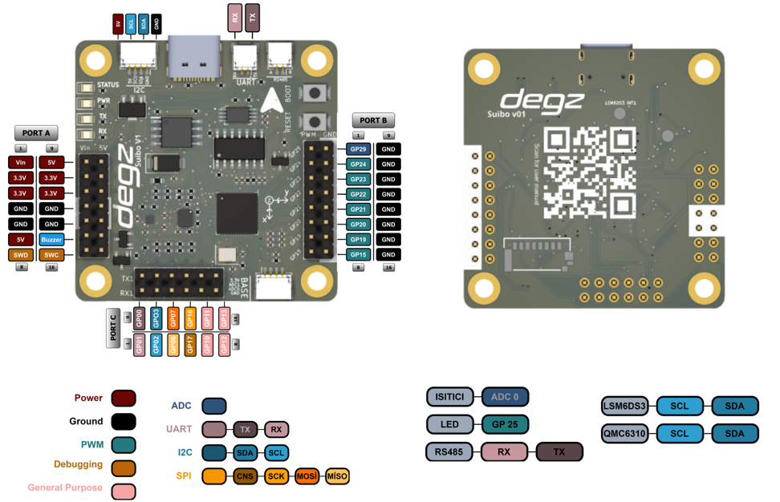

# Ürünün Kullanımı

## Pin diyagramı

 ## Pin  Açıklamaları:

 
|Port A                 | Özellikler                                                                                                                                                                                                                                     |
|----------------------------|--------------------------------------------------------------------------------------------------------------------------------------------------------------------------------------------------------------------------------------------|
<<<<<<< HEAD
|Vin (5V)| Harici güç kaynağından 5V besleme için kullanılır.|
|3.3V | Kart üzerindeki sistemler için 3.3V güç çıkışı sağlar.|
|GND (Ground)| -|
|5V| 5V'luk güç çıkışı sağlar.|
|Buzzer| Ses çıkışı için kullanılan bir buzzer'a bağlanabilir.|
|SWD ,SWC | SWC ve SWD pinleri, mikrodenetleyicinin seri tel hata ayıklama (debugging) için kullanılır.|
|**Port B**               |    **Özellikler** |                                                                                            
| GP29 | ADC pinidir ve analog sinyalleri dijital verilere dönüştürmek için kullanılır.|
|GP24, GP23, GP22, GP21, GP20, GP19, GP15| PWM sinyali üretebilen pinlerdir ve LED'lerin parlaklığını ayarlamak veya motor hızını kontrol etmek gibi işler için kullanılırlar.    |                                                                                         
|**Port C**                 | **Özellikler**                                                                                               
|GP0 (TX) ve GP1 (RX)| Seri iletişim için kullanılır, TX veri göndermek, RX ise veri almak içindir.|
|GP2 (SCL) ve GP3 (SDA)| I2C iletişim protokolü için saat (SCL) ve veri (SDA) hattı olarak kullanılır.|
|GP6 (MISO), GP7 (MOSI), GP17 (CS), GP16 (SCK)| SPI iletişim protokolü için MISO, Master cihazdan Slave cihaza veri almak, MOSI Slave'ten Master'a veri göndermek, CS (Chip Select) aktif edilecek cihazı seçmek ve SCK (Serial Clock) saat sinyali göndermek için kullanılırlar.|
|GP10, GP11, GP12, GP13| Genel amaçlı pinlerdir ve çeşitli giriş/çıkış işlevleri için programlanabilirler. |  
=======
|VIN| Harici güç kaynağı voltaj girişi|
5V| 5 volt güç çıkışı|
|GND| Toprak bağlantısı (ground)
|3V3 |3.3 volt güç çıkışı
|BOOT| Bu pin, genellikle geliştirme kartınızın firmware'ini yüklemek veya güncellemek için kullanılır.|
RUN| Cihazı çalıştırma/kapatma kontrolü|
|SWD|SWD pinleri, kartınızın mikrodenetleyicisinin hata ayıklanması için kullanılan bir protokoldür.
|IO29, IO28, IO27, IO26| Genel amaçlı giriş/çıkış pinleri.
>>>>>>> 28919ba2bf2d2e08cc2b17500a0a5607b95f12ff

    
