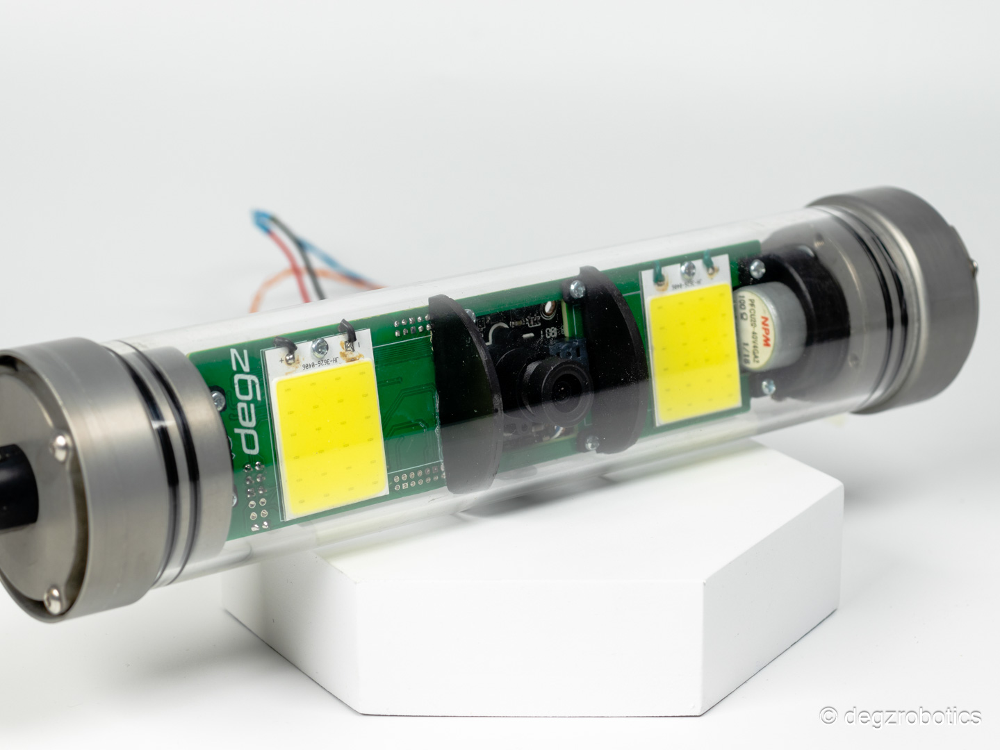

import DocCardList from '@theme/DocCardList';

# About the Product

For a simple and free experience, Rolica Motion Camera System is under your control with 180 degree rotation angle! Compatible with all Degz camera modules, you can easily move your camera with standard PWM signals.

:::info
This product is being updated. Camera module price is not included in the product price, you can choose externally.
:::

 Its built-in directional illumination allows you to work smoothly even in dark environments. Explore the world in 180 degrees with Roli Camera!

- Simple and free, master 180 degrees with Rolica!
  
- Compatible with all Degz camera modules.
  
- You can move your camera 180 degrees with standard pwm signals.
  
- Thanks to its built-in steerable illumination, darkness cannot prevent you from working!

<DocCardList />