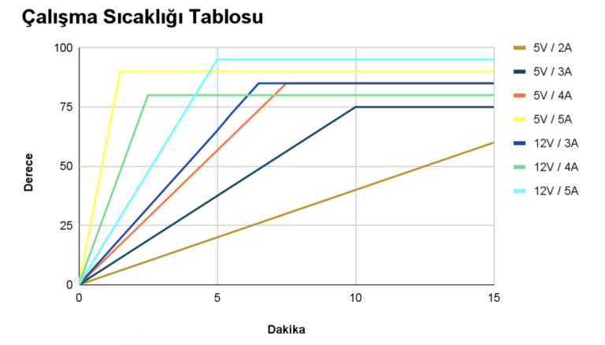

import DocCardList from '@theme/DocCardList';

# 5V 12V Voltage Regulator

This regulator offers users a highly flexible choice of two adjustable outputs ranging from 5V to 12V. Each output can be used independently or together, so you can set two 5V/5A outputs, two 12V/4A outputs, or one output to 5V and one to 12V. Adjustments can be made easily thanks to clear markings on the board.  This regulator has a wide input voltage capability, operating in the 8-36V range or with a 3s-8s Li-Po battery. However, the input does not have reverse connection protection, in which case it is recommended to connect a high current diode in series. With its compact design, it is suitable for use in various electronic projects and adds value to your projects with its ease of use.

# Product Technical Specifications

This regulator provides high power output and has two outputs adjustable between 5V and 12V. The two outputs can be used in different combinations, one with 5V 5A and the other with 12V 4A: either two 5V/5A and two 12V/4A outputs, or one 5V and one 12V.

The output settings are made from the places on the board designated as Volt1 and Volt2. The outputs obtained by combining the pads are as follows:

12V 4A for Volt1,
5V 5A for Volt2.

:::note
You can also set both outputs to 5V or 12V at the same time. However, the voltage output cannot be taken without combining the pads on the back of the board.
:::
## Product Features 

| Main Features | |
|----------------------------|--------------------------------------------------------------------------------------------------------------------------------------------------------------------------------------------------------------------------------------------|
|Input voltage | 8-36V / 3s-8s li-po
| 5V Maximum Output Current | 5000 mA
|12V Maximum Output Current | 4000 mA
|5V/12V Outputs | 3+3 Pin
|Input reverse connection protection| No (A high current diode can be connected in series.)
|****Physical Characteristics**||
|Size| 45 x 45 mm|
|Header Connector| 2.54 mm Header|
|Power Connector| XT30|

Click here [click here](https://degzrobotics.com/product/5v-12v-gerilim-regulatoru/) to buy this product.  

<DocCardList />