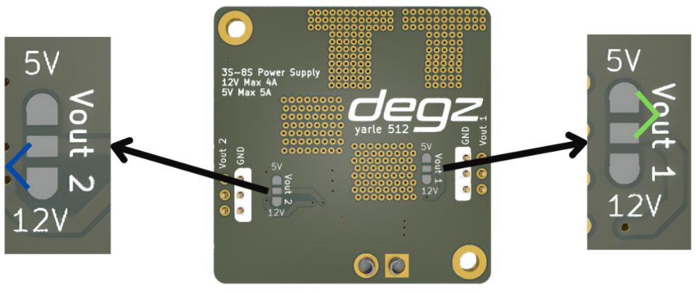

# Use of the product

## Pin Diagram

Meet Degz's new regulator. This card, which you can safely use for your projects, offers you adjustable output voltage. 

## Pin Connections

There are solder pads in the areas indicated by the arrow on the board. When you solder the two of these pads shown with colored markings, you will get a 5v 5000mA output from the left side, that is, from the Vout 2 output. From the right side, that is, from the Vout 1 output, you will get a 12v 4000mA bit output.

::::info
You can get 5 volts or 12 volts from two outputs at the same time according to your needs.
:::
