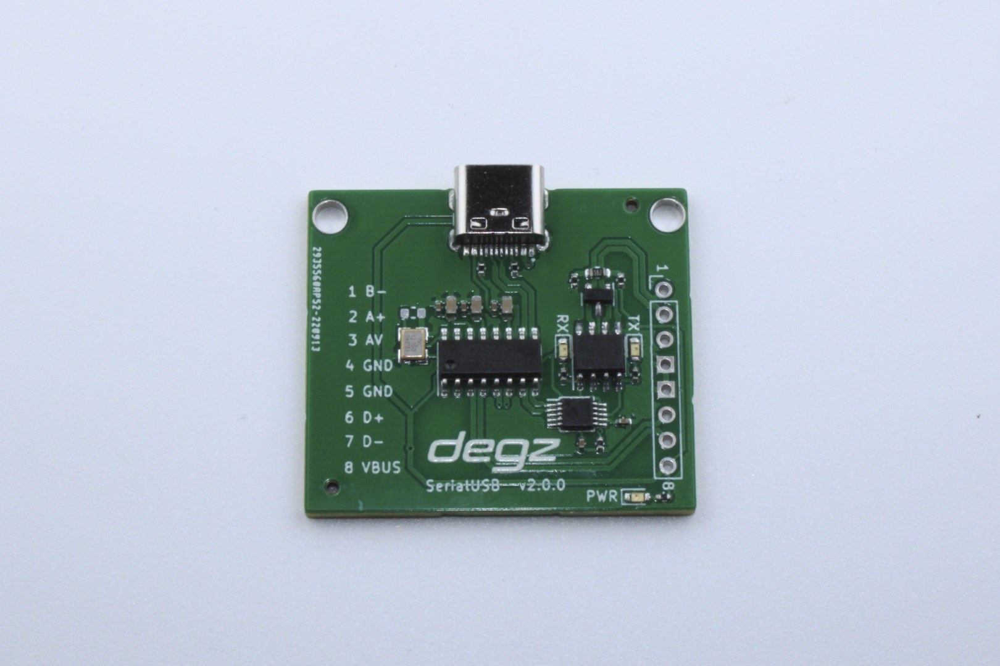

import DocCardList from '@theme/DocCardList';

# About the Product

## High performance, low price

:::warning
This product has been discontinued. So you can check the updated [Degz Sublink](https://degzrobotics.com/product/iletisim-karti-degz-sublink/).  

:::

The Mizucom communication module is a communication board designed specifically for underwater and other wired robotic systems using the RS-485 communication standard. This module has been developed to provide high performance and low latency data transmission. Equipped with a hot-plug feature, this board can be safely plugged and unplugged during operation. It can transmit both high-resolution video and control signals to a PC over a single USB cable. It has a Python-based computer interface and offers a communication range of up to 400 meters. Compatible with analog solvers, users can easily integrate various display devices. Fully compatible with the Mizu development board, Mizucom is equipped with software controls developed specifically for autonomous systems, making it a reliable solution for robotic applications.

# Product Technical Specifications

## About the Card

| Bus Standard | RS485 |
|------------------------------------------------|-------------------|
| Camera Communication | Analog, Analog HD |
| Communication with the underwater station via a 4-way cable | (A, B, AV and GND) |
| Supply Voltage | 5v |
| Compatible Software | Windows / MacOS |

## Usage Diagram

:::warning
This product has been discontinued. So you can check the updated [Degz Sublink](https://degzrobotics.com/product/iletisim-karti-degz-sublink/).  

:::

