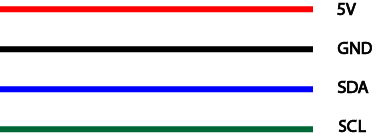

import DocCardList from '@theme/DocCardList';

# D300 Depth and Water Temperature Sensor

This depth and temperature sensor is developed using the MS5837-30BA module and is capable of measuring pressure with an accuracy of 1cm and temperature with an accuracy of ±1°C to a depth of 300 meters. It communicates data over the I2C protocol and uses a 3.3V I2C voltage while operating with a supply voltage between 4.5-5.5V. The sensor includes a warning against the risk of damage when connected to devices operating with 5V I2C voltage. Compatible with PixHawk and similar flight control boards, this device can also be used in ArduPilot and ArduSub supported vehicles.

## About the Board

Feature | |
|----------------------------|--------------------------------------------------------------------------------------------------------------------------------------------------------------------------------------------------------------------------------------------|
|Integration |Sensor is integrated with voltage converter board, easy to intervene. |
Performance | It can measure pressure with 2mm accuracy up to a depth of 300 meters; It offers temperature measurement with ±1°C accuracy. Depth Accuracy is 1cm
|Data Access| provides access to data via I2C, making it easy to use. I2C Voltage is 3.3V.
|Compatibility | Compatible with PixHawk and other flight control boards; supported by ArduPilot and ArduSub.
|Maximum Depth |Can measure up to a depth of 300 meters.
|Sensor Model |Developed using MS5837-30BA.
|Connector Type| JST connector compatible with most flight control boards is used.
|Seal Tightness| Provides high-level performance in sealing in ROVs or UAVs.
|Supply Voltage | 4.5-5.5V |

:::warning
Since this device works with 3.3V i2C Voltage, it will be damaged when connected to devices operating with 5V i2C voltage.
:::

## Sensor outputs

**To buy this product [click here](https://degzrobotics.com/product/derinlik-ve-sicaklik-sensoru/).** 

 

