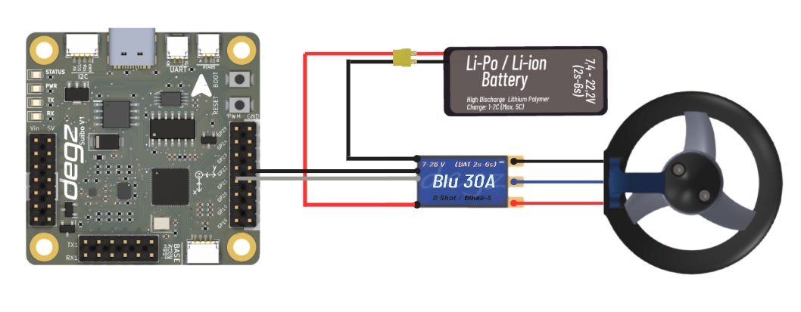

# Use of the product

## Using the Blue 30A ESC

Its three connectors are connected to the motor phases of the Mitras Underwater Thruster. These connections provide power to the motor's brushless coils in different sequences, ensuring precise speed control and efficient operation.
The red and thick black cable of the ESC is connected to the positive and negative inputs of the batteries.

As for the thin black and white wires, they are used to send signals and play a role in controlling the motor.

## Use with other Cards

### Use with Suibo

The BLU 30A ESC brushless motor drive can be operated together with the Suibo board using PWM (Pulse Width Modulation) outputs. This integration allows the ESC to use the PWM signals from the suibo board to control the motor speed.

#### Use with Hi Base

The usage diagram of the BLU 30A ESC brushless motor driver together with the Hi Base board is as follows.

