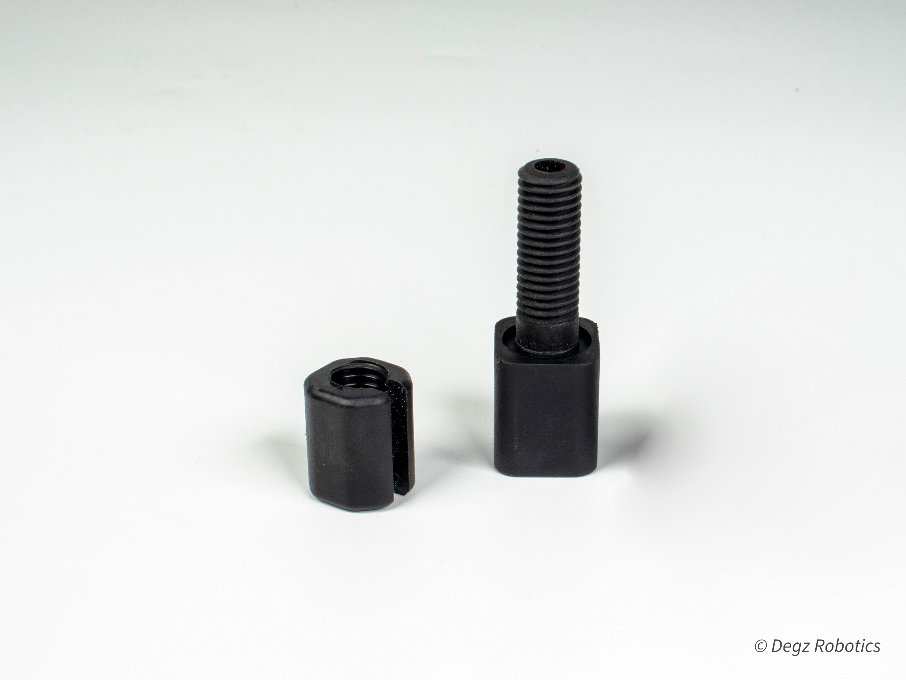

# Neo Penetrator

Degz Neo Penetrator is an innovative fastener used in underwater technology. It offers excellent sealing performance even under high pressure, allowing transferring of cables in a safe and leak-proof manner. Thanks to its reinforced structure with plastic options and epoxy application, it shows durability even in the harshest underwater conditions. Degz Neo Penetrator offers easy installation with O-ring technology and can also be used as a vacuum port, making it a versatile solution that enhances the performance of underwater vehicles.
