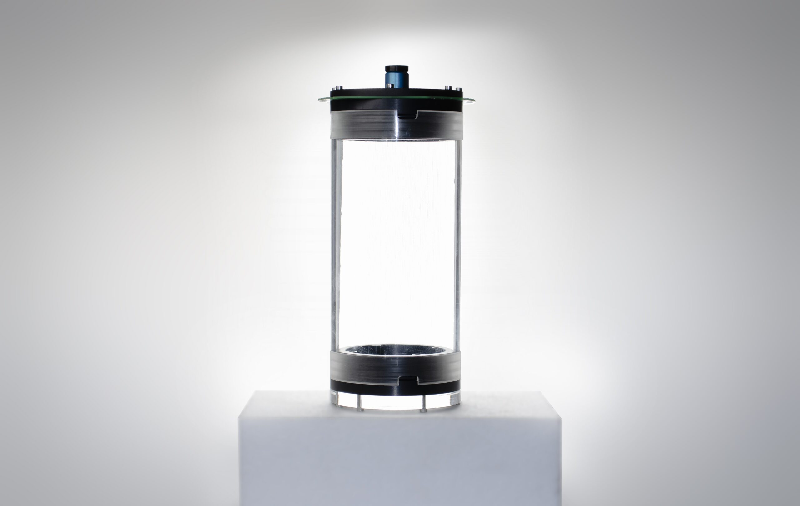
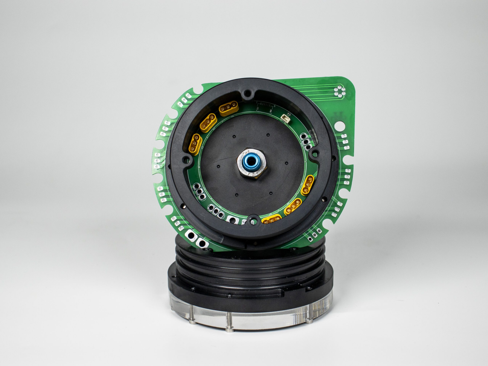

# Ürün Hakkında

H-100 Su Altı Haznesi, başarılı bir hazne serisinin tecrübesiyle tasarlanarak su altı projelerinize özel ek özelliklerle donatıldı. Yeniden tasarlanmış PCB konnektör takımı, özel kilit tasarımı ve penetratör deliği için belirlenmiş kılavuzlar gibi detaylar, bu hazneyi müdahale kolaylığı ve dayanıklılık açısından rakipsiz kılıyor.

Teknik özellikleri arasında iç çap, dış çap, tuzlu suda kullanıma uygun malzeme, ve patentli aktarım teknolojisi gibi unsurlar bulunmaktadır.

- Müdahale kolaylığı için yeniden tasarlanmış PCB konnektör takımı
- Hazne kapağının dönmesini engelleyen özel kilit tasarımı
- Kolaylıkla penetratör deliği açılması için önceden belirlenmiş kılavuzlar

## Teknik Özellikler

- İç Çap 90mm
- Dış Çap 100mm
- Tuzlu suda kullanıma uygun
- Anodize alüminyum ve krom malzeme
- 150 – 200 metre azami derinlik*
- Patentli aktarım teknolojisi
- Daha az sızdırmazlık elemanı(her kapakta aktarımlar dahil 4 adet)
- 8 motora kadar çıkış(24 Pin) / 8pin iletişim hattı / 4 adet(8 pin) - anahtarlama kanalı hattı
- *Azami derinlik, hazne uzunluğuna göre fark göstermektedir.

## Kutu İçeriği

- Akrilik Hazne
- H100 Flanş (2 adet)
- H100 Kapak
- H100 Ön Cam Akriliği
- H100 Aktarıcı Kart
- Kablo Penetratörü
- 3×82 O-ring (7 adet)
- 3ML Özel Gres Yağı
- M3x16 İmbus Civata (14 adet)

## Ağırlıklar

Ön Alüminyum Flanş – 290g

250mm Hazne

Arka Alüminyum Flanş – 300g

250mm akrilik – 430g

300mm akrilik – 520g

350mm akrilik – 610g

## Sensörler

Suyla temas etmesi gereken basınç ve sıcaklık sensörü (MS5837) aktarıcı kart üzerinde dış yüzeyde yer almaktadır. Base modülü anahtarlamak için kullanılan hall effect sensörü ise aktarıcı kartın hazne içine bakan kısmında yer almaktadır. Sensörlerin çıkışları basınç sensörü için, Mavi +3,3V Siyah Gnd Yeşil SDA Beyaz SCL olarak belirlenmiştir. Hall effect sensörü için; sarı Vout Siyah Gnd Kırmızı Vin olarak belirlenmiştir.

## Hazne montaj kılavuzu

Hazne kullanıma ilk hazırlanırken tüm o-ring contaların silikon sıvı gres ile yağlanması gereklidir. Bu özellikle akrilik ile temas eden kısımlarda sürtünmeyi azaltarak contaların aşınmasını engelleyecektir. Diğer yandan silikon gres yağı O-Ringin yüzeye daha iyi oturmasını sağlayacaktır.

Haznenin vidalarını sıkarken tüm vidaların aynı oranda sıkıldığına emin olun. Daha sonra kapağın duruşunu mutlaka kontrol edin, kapakta herhangi bir eğiklik bulunuyorsa tekrar açarak araya sıkışmış bir nesne olup olmadığını kontrol edin. Ön kapakta bunu gözle kontrol etmeniz daha kolaydır. Vidaları sıkarken contaların ne kadar ezildiğini kontrol edin.

<iframe width="100%" height="574" src="https://www.youtube.com/embed/wks-8iuaIAI" title="Degz Sualtı Haznesi" frameborder="0" allow="accelerometer; autoplay; clipboard-write; encrypted-media; gyroscope; picture-in-picture; web-share" allowfullscreen></iframe>

:::info
İlgili videodaki hazne eski versiyona aittir.
:::

:::warning
Hazneyi yere düşürmekten, sert nesnelerin çarpmasından, yüksek sıcaklıktan ve sıkışmalardan koruyun. Hazne içerisine batarya eklediğinizde patlama ihtimaline karşı kapakları açılmayacak şekilde kesinlikle sabitlemeyin. Aktarıcı kartın üzerini kaplamadan tatlı suda yüksek akımla çalışmayan cihazlarla yarım saati aşmayacak şekilde teste tabi tutabilirsiniz ancak testler sonrasında arka halkadaki dış kapağı sökerek kurulayın ve yüzeyi kesinlikle kaplayın. Klorlu su alüminyuma zarar verebilir, havuzlarda uzun süreli kullanımlardan kaçının. Hazneyi tuzlu suya soktuktan sonra her defasında tatlı suda bekletin ve yüzeyde kalan tuzların çıkmasını sağlayın.
:::

<iframe width="100%" height="574" src="https://www.youtube.com/embed/GYWZvBBVTVA" title="Yenilikçi Aktarım Yöntemi | Degz Su Altı Haznesi H-100" frameborder="0" allow="accelerometer; autoplay; clipboard-write; encrypted-media; gyroscope; picture-in-picture; web-share" allowfullscreen></iframe>