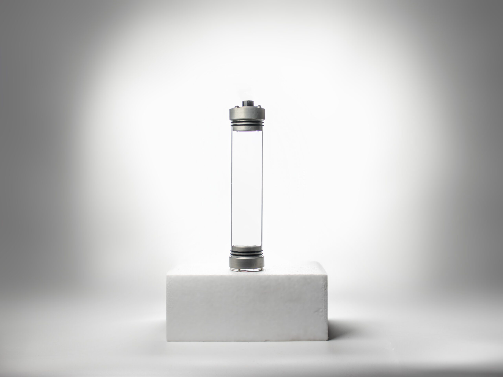

import DocCardList from '@theme/DocCardList';

# Ürün Hakkında

Sızdırmaz haznemiz sualtı araçlarında elektronik sistemi korumak amacıyla geliştirilmiştir. Patenli aktarım teknolojisi kullanılarak geliştirilmiş tek sızdırmaz haznedir. Haznenin dış yüzeyinde yer alan PCB aktarım kartı sayesinde her türlü sualtı tasarımında kolaylıkla kullanılmaktadır.

 Sualtı aracınızın su içerisinde sert bir yüzeye çarpması sonucunda elektronik sisteminizi korumaktadır. Denizde ve havuzda test edilmiştir. Manuel ve otonom sualtı araçları için uygundur. Haznemizin montaj ve lehimleme videolarını izleyerek hızlı bir şekilde kullanmaya başlayabilirsiniz.

<DocCardList />
