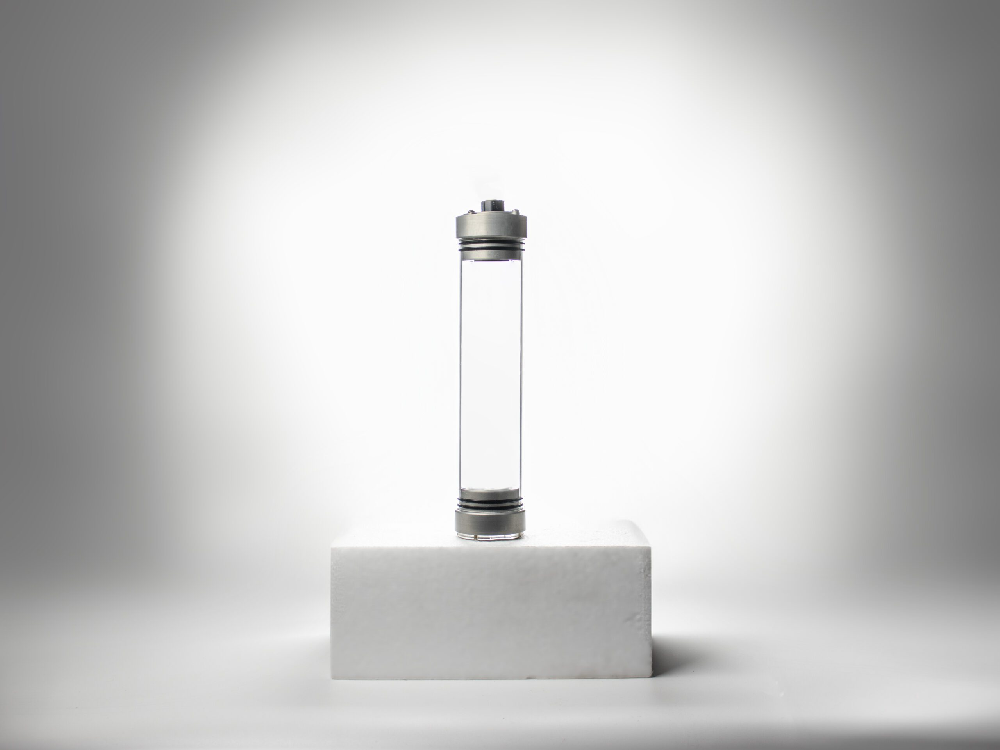

# Ürün Hakkında

Sızdırmaz haznemiz sualtı araçlarında elektronik sistemi korumak amacıyla geliştirilmiştir. Patenli aktarım teknolojisi kullanılarak geliştirilmiş tek sızdırmaz haznedir. Haznenin dış yüzeyinde yer alan PCB aktarım kartı sayesinde her türlü sualtı tasarımında kolaylıkla kullanılmaktadır.

 Sualtı aracınızın su içerisinde sert bir yüzeye çarpması sonucunda elektronik sisteminizi korumaktadır. Denizde ve havuzda test edilmiştir. Manuel ve otonom sualtı araçları için uygundur. Haznemizin montaj ve lehimleme videolarını izleyerek hızlı bir şekilde kullanmaya başlayabilirsiniz.

## Özellikleri

- İç Çap 43mm
- Dış Çap 50mm
- Tuzlu suda kullanıma uygun
- Anodize alüminyum flanş ve pasivize krom vidalar
- 100 – 150 metre azami derinlik*
- Patentli aktarım teknolojisi
- Daha az sızdırmazlık elemanı(her kapakta aktarımlar dahil 4 adet)
- 4 Yüksek akım, 12 düşük akım toplam 16 aktarım pini
- *Azami derinlik, hazne uzunluğuna göre fark göstermektedir.

## Kutu İçeriği

- İster Uzunlukta Akrilik
- H50 Flanş (2 adet)
- H50 Kapak
- H50 Ön Cam Akriliği
- H50 Aktarıcı Kart
- 2×37 O-ring (7 adet)
- Gress
- M3x12 Bombebaş Vida (10 adet)

