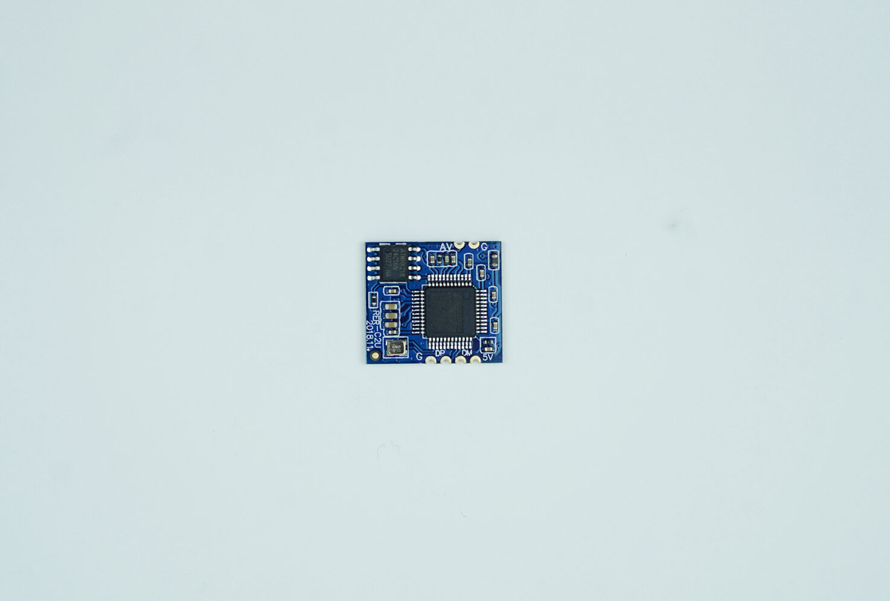

import DocCardList from '@theme/DocCardList';

# Ürün Hakkında

1200TVL Analog Kamera, kritik robotik sistemlerde düşük gecikme ve maliyet avantajlarıyla öne çıkan bir tercihtir.

Elektromanyetik gürültüye karşı dayanıklılığıyla bilinen bu kameralar, herhangi bir gürültü durumunda kesinti veya gecikme yaşatmaz; ancak, bu durum görüntü kalitesini etkileyebilir.

Analog görüntülerin aktarıldığı kablolar elektromanyetik gürültüden ciddi şekilde etkilenir. Bu kablo eğer bir güç hattının yanından geçiyorsa (özellikle kablodan yüksek akım geçişi varsa) sinyali ileten kablonun dış ekranı(kablo içine örülü metalden yapılmış bir kafes) olması oldukça faydalı olur.

**Bu ürünü kullanırken karşılaştığınız  sorunları  bize sormak için  [tıklayınız](https://forum.degzrobotics.com/).**  
<DocCardList />