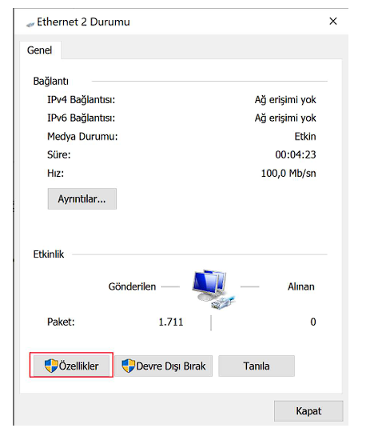

# IP Kamera Bağlantı Yönergesi

Degz IP Kamera için bağlantı yapmak için rehber.

1. Ağ ve Paylaşım Merkezi’nden kablolu ağdaki bağlantılarda bulunan Ethernet ibaresine tıklıyoruz.

2. Açılan pencerede Özellikler’e tıklıyoruz.

3. IPV4 kısmının bulunduğu açıklamaya tıklayıp daha sonra Özellikler’e tıklıyoruz. (Resimde eksik gösterilmiş)

1. Resimdeki IP değerlerini girerek Tamam ve daha sonra Tamam’a tıklıyoruz.

5. Advanced IP Scanner gibi bir IP tarama program kullanarak IP Kamera adresini buluyoruz.

Bu aşama sonrasında bir IP kamera çözücü yazılımı (Örn. IP Camera Viewer) kullanarak veya tarayıcıya bu adresi girerek kamera görüntünüzü izleyebilirsiniz.

:::info

Kamera erişim şifreleri aşağıdaki kombinasyonlardan biridir.

| # | Kullanıcı adı | Şifre  |
|---|---------------|--------|
| 1 | admin         | admin  |
| 2 | "boş"         | "boş"  |
| 3 | admin         | 123456 |
| 4 | admin         | "boş"  |

:::

Pdf olarak indirmek için [tıklayınız](https://degzrobotics.com/wp-content/uploads/2022/04/IP-Kamera.pdf).

**Soru ve önerileriniz için bize [forumdan](https://forum.degzrobotics.com/)    ulaşabilirsiniz .**