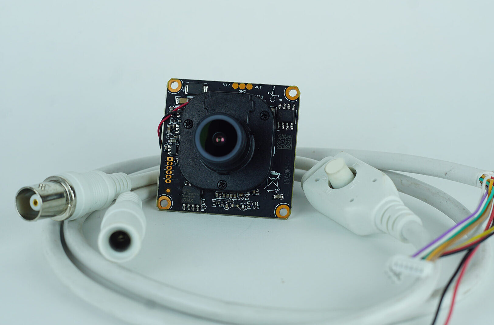
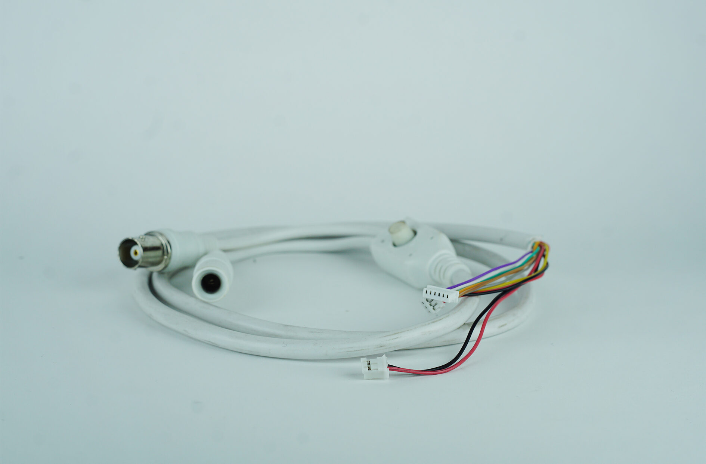

import DocCardList from '@theme/DocCardList';

# Ürün Hakkında

IP Kameralar paket protokolleri ile çalışan yüksek çözünürlüklü kameralardır. 

Dahili olarak bir mikrodenetleyicileri ile paket yapısı kullanılarak görüntüyü aktarırlar. IP kameralar analog kameralara benzer şekilde parazitten etkilenirler, ancak bu asla görüntü kalitesinin bozulması olarak sonuçlanmaz.

 Hat üzerinde oluşan gürültü, paketlerin gecikmesine sebep olur ve bu da görüntünün geç gelme sorunu olarak yansır. IP Sınıfı Cat5-6 kablolar burgulu (twisted pair) olduğundan dolayı analog kameralara göre parazitin etkisi daha düşük olur. Parazit etkisinin azaltılması için Cat 6e veya Cat 7 kablo tipi tercih edilebilir.

**Soru ve önerileriniz için bize [forumdan](https://forum.degzrobotics.com/)    ulaşabilirsiniz .**
<DocCardList />