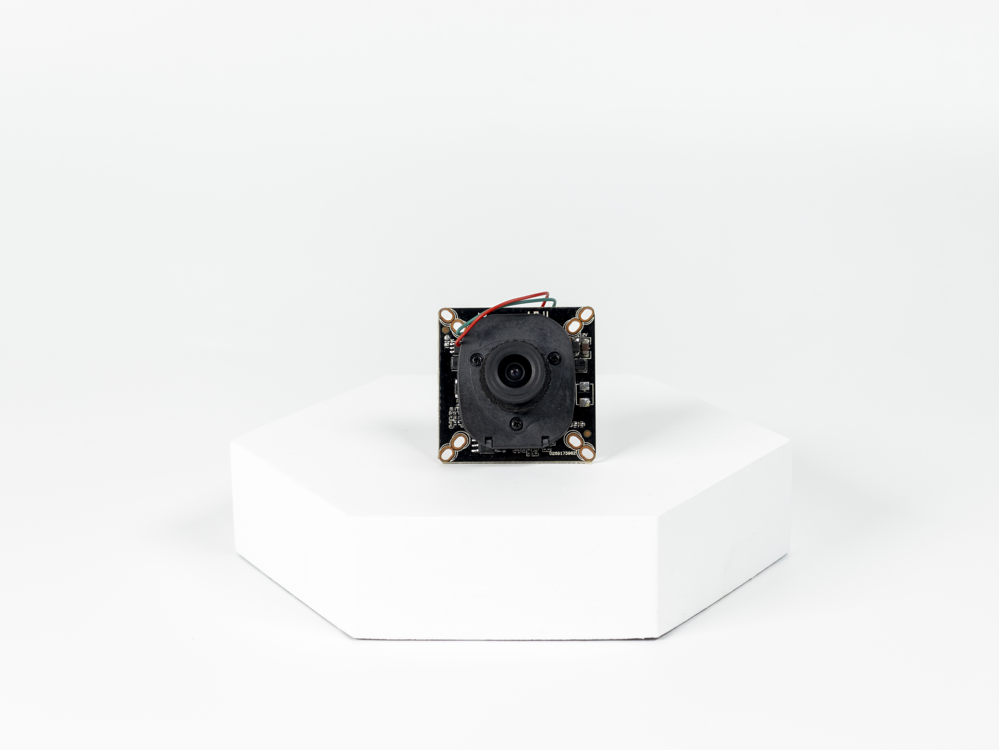
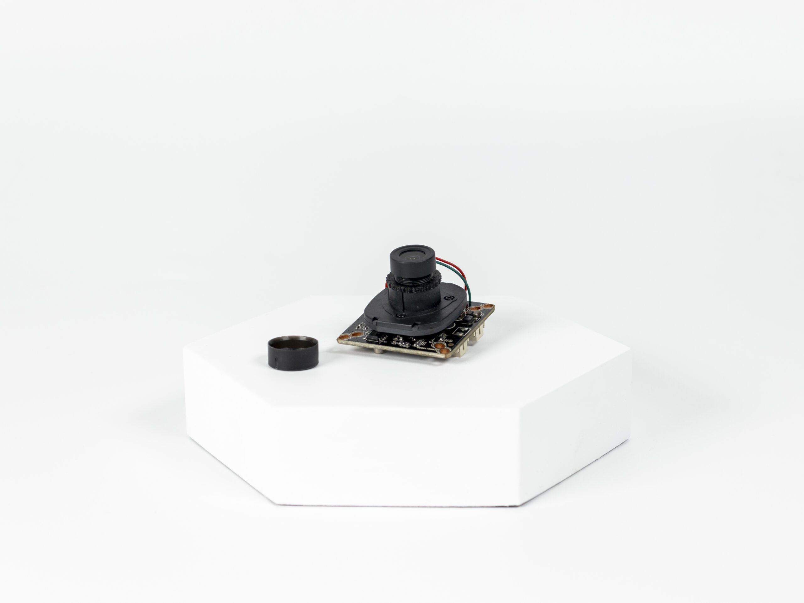

# Ürün Hakkında

Yüksek çözünürlük deneyimini en etkin şekilde yaşayın! Analog HD kamera sistemi, düşük maliyetle birlikte 300 metreye kadar düşük gecikmeli (yaklaşık 100ms) görüntü aktarımı sunar.

Basit ve çözüm odaklı yapısı, standart analog kamera çözünürlüğünden daha yüksek performans vaat ederken, özel çözücülerle entegrasyon gerektirir. Değiştirilebilir lens seçeneği ile istediğiniz görüş açısını elde edebilirsiniz. Analog HD kameralar gürültüye duyarlıdır, bu nedenle ekranlı kablolar önerilir, ancak sinyal hattını bozabilecek bir etmen yoksa ekransız kablolar da kullanılabilir. Teknik özellikler arasında 1920×1080 çözünürlük, >100ms gecikme, değiştirilebilir M12 lens tipi ve 12V besleme gerilimi bulunmaktadır. AHD kamera ile net ve kesintisiz izleme deneyimini keşfedin!

## Yüksek Çözünürlük İle Tanışın

Düşük maliyet ve yüksek çözünürlüğü bir arada bulunduran AHD kamera sistemi, standart koaksiyel kablolar üzerinden 300 metreye kadar düşük gecikmeyle (100ms kadar) görüntü aktarabilir.

## Basit ve Çözüm Odaklı

AHD Kameralar standart analog kamera çözünürlüğünden daha yüksek bir çözünürlük vaat etmekle birlikte, standart analog kamera çözücüleri ile kullanılamaz. AHD Kameralar için özel kamera çözücüleri kullanılması gereklidir. IP kameralara göre daha basit bir sistem yapısı gerektirdiği için analog kameralardan daha yüksek çözünürlüğün arandığı robotik alanlarda sıklıkla kullanılır.

## Değiştirilebilir Lens

Değiştirilebilir lensler ile dilerseniz geniş açı dilerseniz standart görüş açılı olarak görüntü aktarımı yapabilirsiniz.

:::warning
AHD Kameralar, analog kameralar gibi gürültüden etkilenebilir, bu yüzden analog kameralardakine benzer ekranlı kablolar ile görüntünün aktarılması uygun olacaktır. Ancak sinyal hattını bozabilecek herhangi bir etmen yoksa ekransız kablolar ile de kullanılabilir.
:::

## Teknik Özellikler

| Özellik             | Değer                |
|---------------------|----------------------|
| Görüntü Çözünürlüğü | 1920×1080            |
| Gecikme             | `<100ms`             |
| Lens                | 3mm                  |
| Lens Tipi           | Değiştirilebilir M12 |
| Besleme Gerilimi    | 12V                  |

## Kutu İçeriği

- Analog HD 1080P Kamera
- JST XH 2.54mm 3 Pin Kablo
- LM7512 Lineer Regülatör
- Lens
- Lens Sabitleme ve Vidaları

<iframe width="100%" height="574" src="https://www.youtube.com/embed/gdNUwNv4al0" title="ANALOG HD (AHD) KAMERALAR NASIL KULLANILIR" frameborder="0" allow="accelerometer; autoplay; clipboard-write; encrypted-media; gyroscope; picture-in-picture; web-share" allowfullscreen></iframe>
