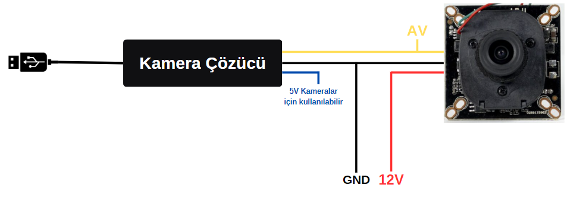
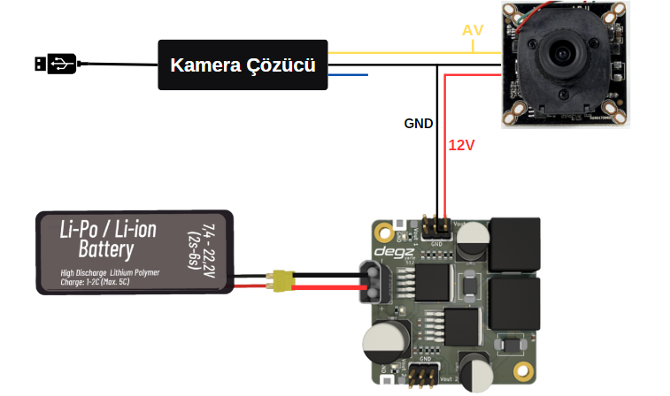

# Ürün  Kullanımı

## Analog Kamera Pin Diyagramı 

Görülen şematik diyagram, bir Analog High Definition (AHD) kamerasının temel bağlantılarını göstermektedir. Kameranın video çıkışı (AV), sarı renkli kablo üzerinden kamera çözücüsünün ilgili giriş terminaline bağlanır. Kırmızı renkli kablo, 12 Volt DC besleme voltajını taşıyarak kameranın enerji ihtiyacını karşılar. Siyah renkli kablo ise sistemin topraklama (GND) bağlantısını sağlayarak elektriksel devre bütünlüğünü oluşturur ve potansiyel gürültüyü minimize eder.

Şematik diyagrama ek olarak, kamera çözücünün mavi renkli çıkış terminali, 5 volt ile çalışan kameralar için güç beslemesi olarak da kullanılabilecek şekilde tasarlanmıştır. Eğer sisteme bağlanacak olan kamera 5 volt DC besleme voltajında çalışıyorsa, bu çıkış üzerinden gerekli enerji sağlanabilir. Ayrıca, kamera çözücüsü doğrudan bir bilgisayara USB arayüzü üzerinden bağlandığında, kameranın video verilerini alması ve işlemesi mümkün olacaktır. Bu özellik, kullanıcıların kamera görüntülerini gerçek zamanlı olarak izleyebilmeleri için önemli bir konfor ve erişilebilirlik sağlar.

## Analog Kamera  ve Yarle Regülatörünün Bağlantı Diyagramı

## Ürünün Kullanımı

<iframe width="100%" height="574" src="https://www.youtube.com/embed/gdNUwNv4al0" title="ANALOG HD (AHD) KAMERALAR NASIL KULLANILIR" frameborder="0" allow="accelerometer; autoplay; clipboard-write; encrypted-media; gyroscope; picture-in-picture; web-share" allowfullscreen></iframe>

**Soru ve önerileriniz için bize [forumdan](https://forum.degzrobotics.com/)    ulaşabilirsiniz .**