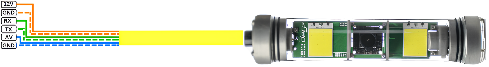

import DocCardList from '@theme/DocCardList';

# Ürün Hakkında

Rolica Hareketli Kamera Sistemi, 180 derece serbest dönüş ile üstün görüntüleme sağlar. Standart PWM sinyalleriyle çalışan bu sistem, Degz bünyesindeki tüm kamera modülleri ile uyumlu olup, kullanıcıların kamera yönünü kolayca ayarlamalarını mümkün kılar. 12V çalışma voltajı ve 150 metre maksimum derinlik kapasitesi ile Rolica, esnek ve genişletilebilir bir çözüm sunar. Sistem, kamera içermez ve isteğe bağlı olarak ek kamera modülleriyle kişiselleştirilebilir.

## Ürünün Teknik Özellikleri

|     Özellikler           |       	Açıklama       |
|--------------------------|-----------------------|
|Çalışma Voltajı|	12V|
|Kamera Dönüş Açısı	|180 Derece Serbest|
|Azami Derinlik|	150 metre|
|1500 ms PWM|	Sabit|
|2000 ms PWM'ye kadar|	Saat Yönü|
|1000 ms PWM'ye kadar	|Saat Yönü Tersi|

- 1 Ağustos itibarı ile Rolica güncellenmiştir. Bu tarihten sonra güncel hali sizlere sunulacaktır.
- Güncellenen Rolica'da istenmeyen sebeplerden dolayı dahili aydınlatma kaldırılmıştır.
- Daha iyi kamera dönüşleri için Step motor yerine Servo motor eklenmiştir.

## Ürünün Pin Diyagramı
- Görselde görünen pin diyagramı step motorlu sistem içindir.
- Servo motorlu sistem için bağlantılarda; RX pini yerine, PWM kablosunu; TX pini yerine GND kablosunu bağlamanız gerekmektedir.

**Soru ve önerileriniz için bize [forumdan](https://forum.degzrobotics.com/)    ulaşabilirsiniz .**

<DocCardList />