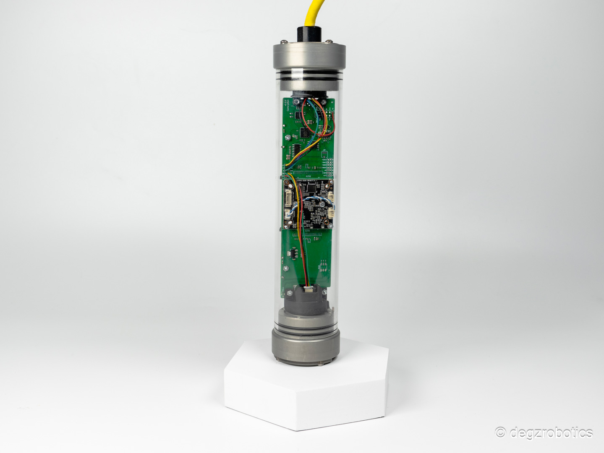

# Ürün Hakkında

Sade ve özgür bir deneyim için Rolica Hareketli Kamera Sistemi, 180 derece dönüş açısı ile sizin kontrolünüzde! Degz bünyesindeki tüm kamera modülleri ile uyumlu, standart PWM sinyalleriyle kameranızı kolayca hareket ettirebilirsiniz.

:::info
Bu ürün güncellenmektedir. Kamera modül fiyatı ürün fiyatına dahil değildir, harici olarak seçebilirsiniz.
:::

 Dahili yönlendirilebilir aydınlatması, karanlık ortamlarda bile sorunsuz çalışmanızı sağlar. Roli Kamera ile dünyayı 180 dereceyle keşfedin!

- Sade ve özgür, Rolica ile 180 dereceye hakim olun!
  
- Degz bünyesindeki tüm kamera modülleri ile uyumludur.
  
- Standart pwm sinyalleri ile kameranızı 180 derece hareket ettirebilirsiniz.
  
- Dahili yönlendirilebilir aydınlatması sayesinde karanlıklar çalışmanızı engelleyemez!

## Teknik Özellikler

Çalışma Voltajı – 12V
Kamera Dönüş Açısı – 180 Derece Serbest
Aydınlatma Şiddeti – 1000lm
Aydınlatma Dönüş Açısı – Kameraya sabit- 180 derece
Azami Derinlik – 150 metre
1500 ms pwm – Sabit

2000 ms pwm’e kadar – Saat Yönü

1000 ms pwm’e kadar – Saat Yönü Tersi

:::note
Sisteme kamera dahil değildir, dilediğiniz kamerayı ek olarak satın alırsanız sisteme eklenerek gönderilecektir.
:::

## Kutu İçeriği

- Rolica Hareketli Kamera Sistemi
- Dişi 2 Pin Jumper (2 adet)
- Erkek 2 Pin Jumper (2 adet)
- LM2596 Ayarlanabilir Regülatör
