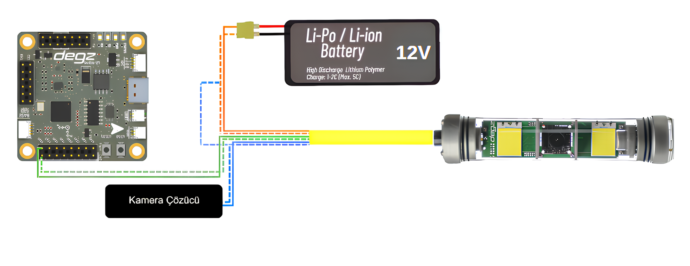

# Ürünün Kullanımı (Servo)

## Ürünün Bağlantı Şeması 




Roli Kamera Sistemi, denizlerin derinliklerinde bile etkileyici bir görüntü kalitesi sunan, son derece duyarlı bir kamera kontrol sistemidir. Bu sistemde, turuncu kablo pozitif güç hattı olarak 12V beslemeyi kameraya iletirken, turuncu-beyaz kablo güvenilir bir topraklama (GND) için kullanılıyor. Yön kontrolü yeşil kablo ile PWM sinyali ile  kontrol ediliyor,mikroişlemci tarafında pwm uyumlu bir pine bağlanıyor, yeşil-beyaz ise GND pinine bağlanıyor.

Kamera için video sinyallerini taşıyan mavi AV kablosu, görüntüleri Çözücü  kartına aktarırken, mavi-beyaz ise bu işlevin kararlı bir şekilde yerine getirilmesi için gerekli olan GND bağlantısını sağlıyor. Özellikle önemli olan ise, tüm bu bağlantılar kurulurken, **GND hattının sistem bileşenleri arasında ortaklanması gerektiği** . Bu ortak toprak bağlantısı, tüm sistem elemanlarının aynı elektriksel referans noktasını paylaşmasını sağlayarak iletişimi daha da güvenilir kılıyor.

## Rolica Kamera Hareket Sistemi Arduino Test Kodu 

````
#include <Servo.h>

Servo myservo;  // Servo motor objesi oluştur

int pos = 0;    // Servo motorun pozisyonunu saklamak için değişken

// rp2040 için minimum ve maksimum darbe genişliği ayarları
//arduino  kullanıyorsanız yorum satırı ile alttaki iki satırı kapatın
int minPulse = 500;  // Mikro-saniye cinsinden minimum darbe genişliği
int maxPulse = 2500; // Mikro-saniye cinsinden maksimum darbe genişliği

void setup() {
  // Servo motoru belirli darbe genişliği aralığıyla bağla
  myservo.attach(9, minPulse, maxPulse);  
}

void loop() {
  // 0'dan 180 dereceye kadar döner
  for (pos = 0; pos <= 180; pos += 1) {
    myservo.write(pos);  // Servo motoru pozisyona ayarla
    delay(15);           // Pozisyona ulaşması için bekle
  }
  
  // 180 dereceden 0 dereceye geri döner
  for (pos = 180; pos >= 0; pos -= 1) {
    myservo.write(pos);  // Servo motoru pozisyona ayarla
    delay(15);           // Pozisyona ulaşması için bekle
  }
}
````
- Bu kod rolicanın maksimum dönüşlerini test etmek için hazırlanmıştır. Bu kodu referans alarak istediğiniz şekilde dönderebilirsiniz.

**Soru ve önerileriniz için bize [forumdan](https://forum.degzrobotics.com/)    ulaşabilirsiniz .**