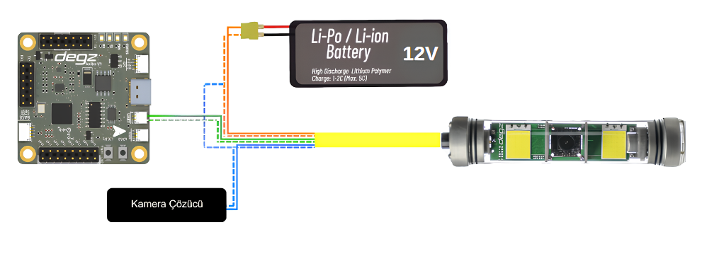

## Ürünün Bağlantı Şeması 




Roli Kamera Sistemi, denizlerin derinliklerinde bile etkileyici bir görüntü kalitesi sunan, son derece duyarlı bir kamera kontrol sistemidir. Bu sistemde, turuncu kablo pozitif güç hattı olarak 12V beslemeyi kameraya iletirken, turuncu-beyaz kablo güvenilir bir topraklama (GND) için kullanılıyor. Veri iletişimi yeşil Rx ve yeşil-beyaz Tx hatları üzerinden gerçekleşiyor; bu hatlar, kontrol kartı ile kamera modülü arasında seri veri alışverişini sağlıyor, yani sistemdeki komutlar ve yanıtlar bu yolları takip ediyor.

Kamera için video sinyallerini taşıyan mavi AV kablosu, görüntüleri Çözücü  kartına aktarırken, mavi-beyaz ise bu işlevin kararlı bir şekilde yerine getirilmesi için gerekli olan toprak bağlantısını sağlıyor. Sistem, UART protokolü kullanarak özel bir paketleme yöntemi ile haberleşiyor, bu da Roli Kamera'nın alıcı ve verici hatları arasındaki veri akışını düzenliyor. Özellikle önemli olan ise, tüm bu bağlantılar kurulurken, **GND hattının sistem bileşenleri arasında ortaklanması gerektiği** . Bu ortak toprak bağlantısı, tüm sistem elemanlarının aynı elektriksel referans noktasını paylaşmasını sağlayarak iletişimi daha da güvenilir kılıyor.

## Rolica Kamera Hareket Sistemi Arduino Kontrol Kodu 

````
#include "SerialTransfer.h" // SerialTransfer kütüphanesini dahil eder, seri haberleşme kolaylaştırılır.
#include "CommunicationPackets.h" // Özel haberleşme paketlerini tanımlayan kütüphaneyi dahil eder.

unsigned long lastUpdateTime, updateInterval = 50; // Son güncelleme zamanını ve güncelleme aralığını tutar (milisaniye cinsinden).
SerialTransfer serialTransfer; // Seri haberleşme için SerialTransfer nesnesi yaratır.
RoliCam roliCam; // RoliCam nesnesi oluşturur.

void setup() {
  Serial1.begin(9600); // 9600 baud hızında seri haberleşmeyi başlatır.
  serialTransfer.begin(Serial1); // SerialTransfer nesnesini belirli seri port ile başlatır.
}

void loop() {
  unsigned long now = millis(); // Geçerli zamanı milisaniye cinsinden alır.
  // Eğer belirlenen güncelleme aralığından daha az zaman geçtiyse, loop'un geri kalanını atlar.
  if (now - lastUpdateTime < updateInterval) return;
  lastUpdateTime = now; // Son güncelleme zamanını şimdiki zaman yapar.

  // Kamera açı ve aydınlatma seviyesini belirli değerlere ayarlar.
  // Bu işlemi belirli bir sırayla ve gecikmelerle tekrarlar.
  
  SetRoliCam(50,50);
  delay(150);
  SetRoliCam(50,0);
  delay(150);
  SetRoliCam(50,50);
  delay(150);
  SetRoliCam(50,0);
  delay(150);
  SetRoliCam(50,50);
  delay(150);
  SetRoliCam(50,0);
  delay(150);
  SetRoliCam(50,50);
  delay(150);
  SetRoliCam(50,0);
  delay(150);
  SetRoliCam(100,50);
  delay(1000);
  SetRoliCam(0,50);
  delay(1000);


  // Rastgele açı ve aydınlatma düzeyi oluşturur ve kamerayı bu değerlere doğru yavaşça hareket ettirir.
  /*
  int targetAngle = random(0, 181);  // Rastgele açı üretir (0 ile 180 arası).
  int targetDim = random(0, 101);    // Rastgele aydınlatma düzeyi üretir (0 ile 100 arası).

  // Kamerayı yavaşça hedef açı ve aydınlatma düzeyine doğru hareket ettirir.
  int deltaAngle = (targetAngle - roliCam.angle) / 10;
  int deltaDim = (targetDim - roliCam.dim) / 10;

  roliCam.angle = constrain(roliCam.angle + deltaAngle, 0, 180);
  roliCam.dim = constrain(roliCam.dim + deltaDim, 0, 100);
  
  uint16_t sendSize = 0;
  sendSize = serialTransfer.txObj(roliCam, sendSize);
  serialTransfer.sendData(sendSize);

  delay(500);  // Kameranın istenen pozisyona ulaşması için gerekli zamanı ayarlar.
  */
}

void SetRoliCam(int targetAngle, int targetDim){
  // Hedef açı ve aydınlatma düzeyine doğru kamerayı yavaşça hareket ettirir.
  roliCam.angle = constrain(targetAngle, 0, 180); // Açıyı 0 ile 180 derece arasında sınırlar.
  roliCam.dim = constrain(targetDim, 0, 100); // Aydınlatmayı 0 ile 100 arasında sınırlar.

  uint16_t sendSize = 0;
  // roliCam nesnesini seri port üzerinden göndermek için hazırlar ve boyutunu hesaplar.
  sendSize = serialTransfer.txObj(roliCam, sendSize);
  // Hazırlanan paketi seri port üzerinden gönderir.
  serialTransfer.sendData(sendSize);

}
````

### CommunicationPackets.h
````
#pragma once
struct __attribute__((packed)) RoliCam {
  int angle;
  int speed;
  int reset;
  int dim;
};
````

**Soru ve önerileriniz için bize [forumdan](https://forum.degzrobotics.com/)    ulaşabilirsiniz .**