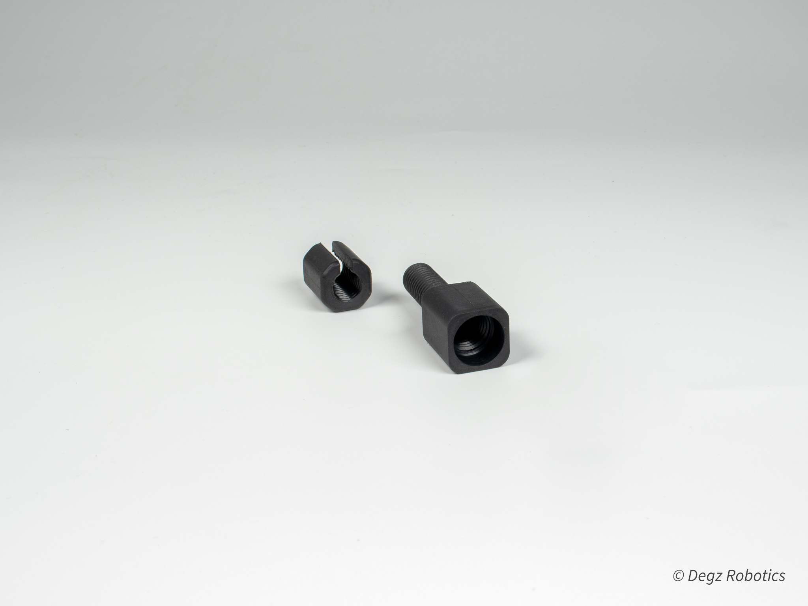

# Neo Penetratör

## Sualtı İnovasyonunun Zirvesi:  Sızdırmazlığın Yeniden Tanımı

Sualtı teknolojisinde çığır açan bir yenilik olan Neo Penetratör, yüksek basınç altında bile kusursuz bir sızdırmazlık sunarak, sualtı araçları için vazgeçilmez bir çözüm haline gelmiştir. Bu bağlantı elemanı, sualtı araçlarının kompleks görevlerini sorunsuz bir şekilde yerine getirebilmesi için kabloların güvenli ve sızdırmaz bir şekilde iç mekana taşınmasını sağlar.

## Üstün Malzeme ve Yapı Kalitesi 

Her türlü zorlu sualtı koşuluna dayanıklı olarak tasarlanmış Neo Penetratör, metal ve plastik seçenekleriyle her projenin ihtiyacına uygun çözümler sunar. Epoksi uygulama imkanı sayesinde daha da güçlendirilen bu yapı, sualtı araçlarının en zorlu görevlerde bile yüksek performans göstermesini sağlar.

## Kolay Montaj ve Çok Yönlü Kullanım

Basit montaj süreci ve çok yönlü kullanımı ile öne çıkan Neo Penetratör, sualtı teknolojisinde işlevsellik ve kolaylık anlamında yeni bir standart belirler. O-ring teknolojisi sayesinde mükemmel sızdırmazlık sunan bu ürün, vakum portu olarak da kullanılabilir, böylece sualtı araçlarının performansını artırır.

## İleri Teknoloji ve Adaptasyon

Neo Penetratör, switch olarak kullanılabilme ve basınç sensörü entegrasyonu gibi özellikleri ile sualtı teknolojisinde adaptasyon ve işlevsellik sınırlarını zorlar. Bu özellikler, kullanıcıların sualtı projelerinde daha geniş bir yelpazede çalışmalarına ve yenilikçi çözümler geliştirmelerine olanak tanır.
