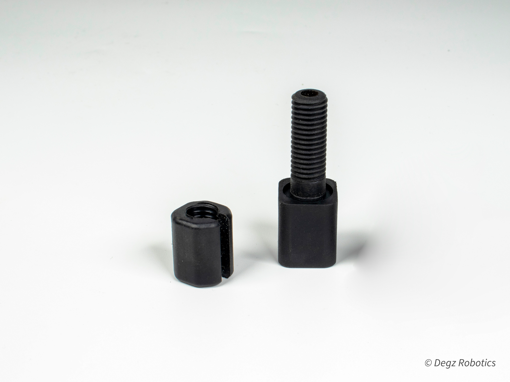

# Neo Penetratör

Degz Neo Penetratör, su altı teknolojisinde kullanılan yenilikçi bir bağlantı elemanıdır. Yüksek basınç altında bile mükemmel bir sızdırmazlık performansı sunarak su altı araçlarının kablolarını güvenli ve sızdırmaz bir şekilde taşımasına olanak tanır. Plastik seçenekleri ve epoksi uygulaması ile güçlendirilmiş yapısı sayesinde, en zorlu su altı koşullarında dahi dayanıklılık gösterir. O-ring teknolojisi ile kolay montaj imkanı sunan Degz Neo Penetratör, vakum portu olarak da kullanılabilir, bu özelliğiyle su altı araçlarının performansını artıran çok yönlü bir çözümdür.

**Bu ürünü kullanırken karşılaştığınız  sorunları  bize sormak için  [tıklayınız](https://forum.degzrobotics.com/).**  