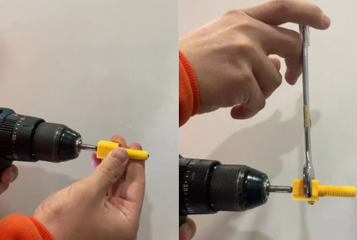

# Neo Penetratör

Degz Neo Penetratör, su altı teknolojisinde kullanılan yenilikçi bir bağlantı elemanıdır. Yüksek basınç altında bile mükemmel bir sızdırmazlık performansı sunarak su altı araçlarının kablolarını güvenli ve sızdırmaz bir şekilde taşımasına olanak tanır. Plastik seçenekleri ve epoksi uygulaması ile güçlendirilmiş yapısı sayesinde, en zorlu su altı koşullarında dahi dayanıklılık gösterir. O-ring teknolojisi ile kolay montaj imkanı sunan Degz Neo Penetratör, vakum portu olarak da kullanılabilir, bu özelliğiyle su altı araçlarının performansını artıran çok yönlü bir çözümdür.

## Penetratör Grafik Çizimi 

Bu penetratörün tasarımında, iç çapı özenle 5mm olarak belirlenmiştir. Ancak, müşterilerimizin çeşitli kullanım ihtiyaçlarına uyum sağlayabilmek adına, bu iç çapın matkap kullanarak 6mm'ye kadar genişletilmesine olanak tanımaktayız. Delme işlemini gerçekleştirirken, matkabın fotoğraflardaki gibi  baş kısmından gövde kısmına doğru  kullanmanız gerekmektedir. Ayrıca, penetratörün kafa kısmını, işlem sırasında uygun bir anahtar yardımıyla sabit tutmanız işinizi kolaylaştıracaktır. Lütfen, güvenlik ve ürün performansı standartlarımız gereğince, iç çapı 6mm'den fazla genişletmemeniz gerektiğini unutmayınız.

**Soru ve önerileriniz için bize [forumdan](https://forum.degzrobotics.com/)    ulaşabilirsiniz .**