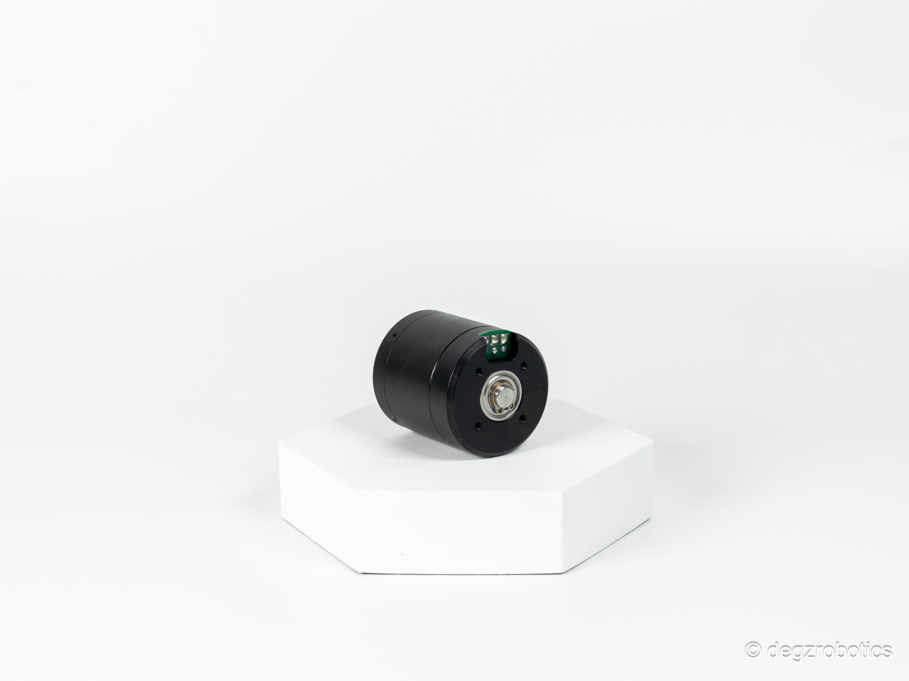
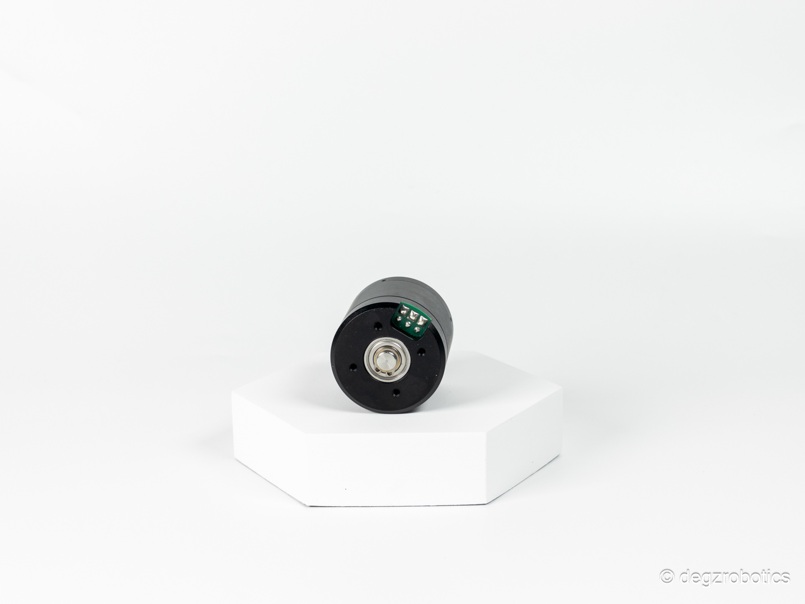

import DocCardList from '@theme/DocCardList';

# Ürün Hakkında

M1 Su Geçirmez Su Altı Motoru sertleştirilmiş kaplamaya sahip statoruyla sınırsız derinliğe dalabilir. 3s-6s voltaj aralığı, 8A sürekli akım, 12A peak akım, 350kv voltaj-devir ilişkisi. Dayanıklı anodize alüminyum gövde, tuzlu suya dirençli rulmanlar ve tamamen izole edilmiş sargılarla güvenilir itici güç.

Deringezen (insansız sualtı aracı) motoru olarak bilinen bu motor, tamamen sertleştirilmiş kaplamaya sahip stator kısmı sayesinde neredeyse limitsiz bir derinliğe kadar dalabilir ve aracınızın ihtiyaç duyduğu itici olarak vazifesini sürdürmesini sağlar.

<DocCardList />
