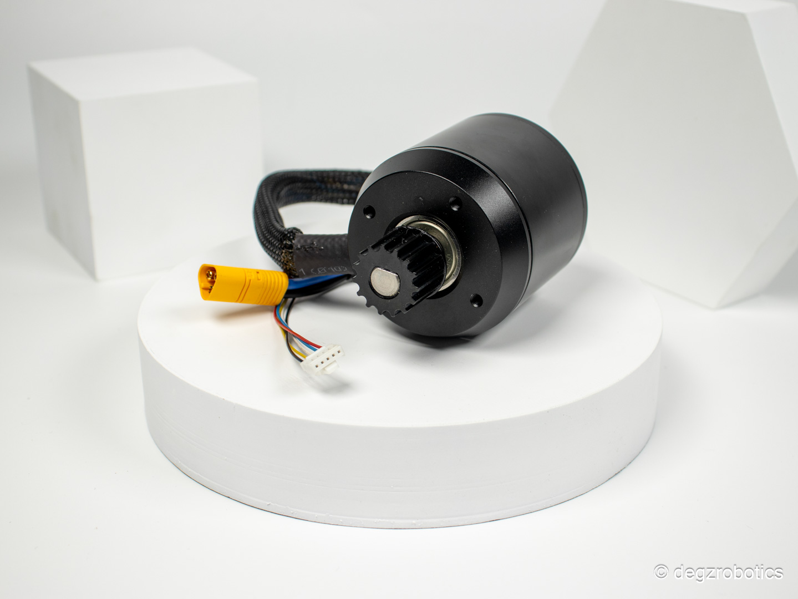
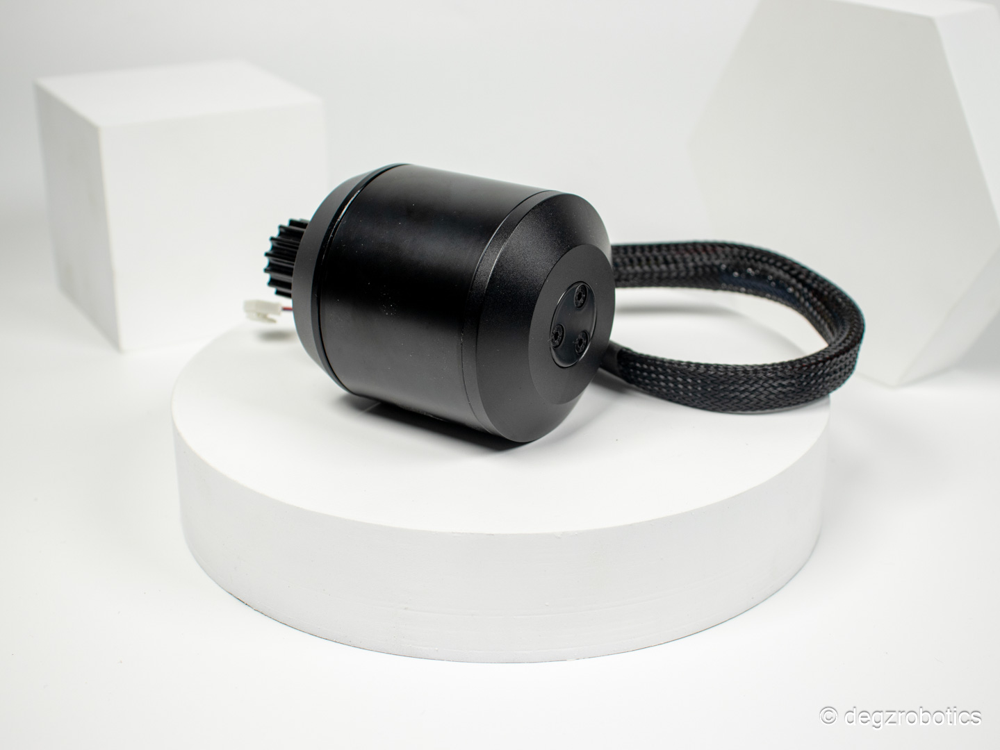

import DocCardList from '@theme/DocCardList';

# Ürün Hakkında

Ağır yükler için optimize edilmiş M5 karşınızda!
Yüksek performanslı ve sertleştirilmiş kaplamaya sahip M5 Su Geçirmez Su Altı Motoru, 9kg/f’a kadar itki gücü sunarak sualtı araçlarınız için ideal bir çözümdür. 3s-6s voltaj aralığında çalışabilen motorumuz, 650W sürekli güç ve 1200W 10 saniyelik maksimum güç ile öne çıkıyor. Tuzlu suya dayanıklı rulmanları ve tamamen izole edilmiş sargılarıyla güvenilir ve dayanıklı bir seçenektir. Aracınızın ihtiyacı olan güç ve performansı sağlamak için tasarlandı.

Utras iticinin çekirdeğini oluşturan bu yüksek performanslı motor, uygun tasarımlarda 9kg/f’a kadar itki gücü oluşturabilmektedir. İnsansız sualtı aracı motoru olarak bilinen M5 Su Geçirmez Su Altı Motoru, tamamen sertleştirilmiş kaplamaya sahip stator kısmı sayesinde neredeyse limitsiz bir derinliğe kadar dalabilir ve aracınızın ihtiyaç duyduğu iticinin aralıksız çalışmasını sağlar.

<DocCardList />
