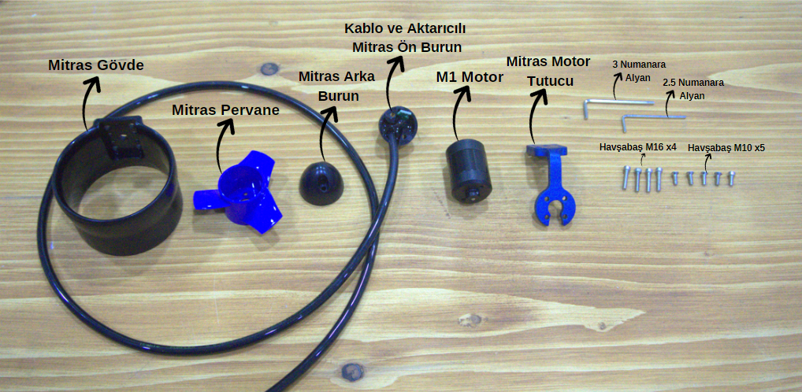
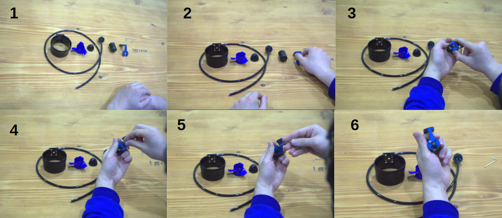
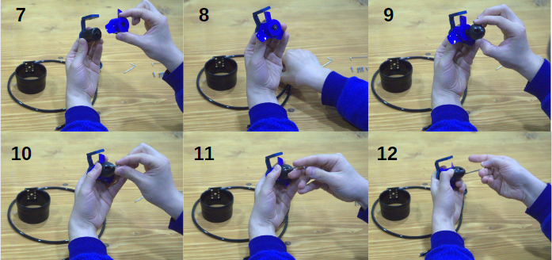
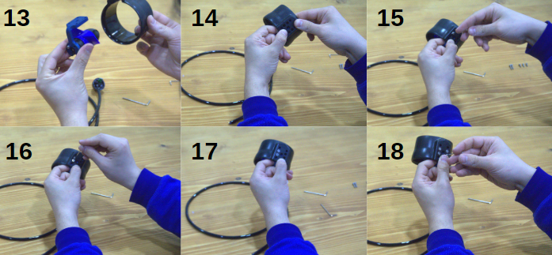
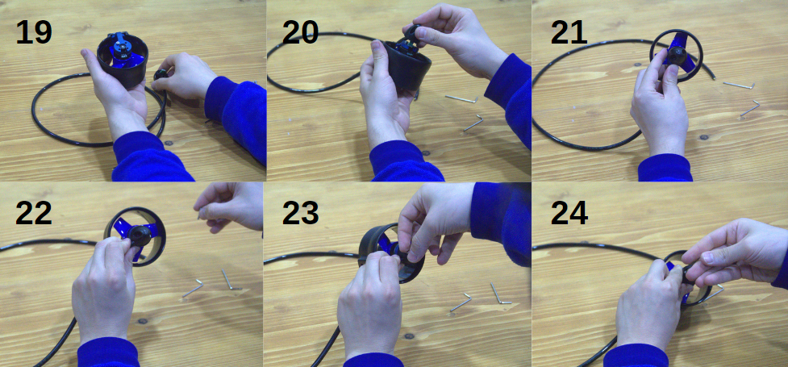
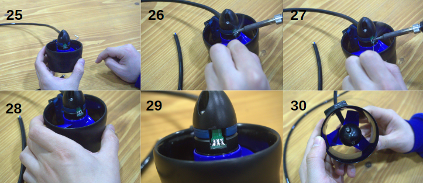
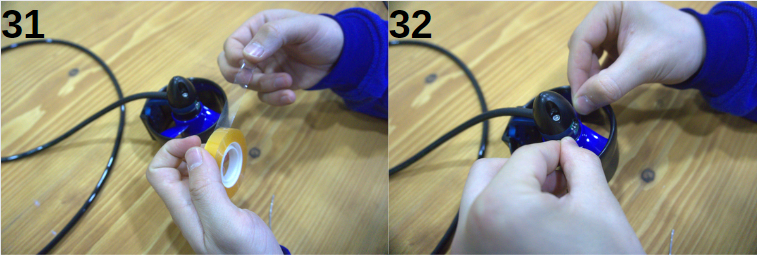

import DocCardList from '@theme/DocCardList';

# Mitras Su Altı iticisinin  Toplanması

## Adım 1: Motor Montajı
Motorun montajına başlarken, ilk olarak siyah renkli M1 Motor'umuzu alıp, mavi renkli Mitras Motor Tutucu içine yerleştiriyoruz. Bu iki parçayı birleştirirken, M10x15 boyutunda yalnızca bir adet vidayı kullanıyoruz. Vida, motorun gövdesindeki delik ile motor tutucunun karşılık gelen deliğine geçirilerek sabitleniyor. Vidalamayı yaparken, vidanın tam oturduğundan ve motorun tutucuya sağlam bir şekilde monte edildiğinden emin oluyoruz. Böylece motorumuz, tutucuya güvenli bir şekilde sabitlenmiş oluyor ve sonraki montaj adımlarına geçmeye hazırız.

## Adım 2: Pervane ve Arka Burun Montajı
Motorumuzun montajına devam ederken, şimdi M1 Motor'un diğer ucuna mavi renkli Mitras Pervane'yi takıyoruz. Pervaneyi motor miline iterek yerleştiriyoruz. Pervane montajından sonra, üzerine mavi renkli Mitras Arka Burun'u geçiriyoruz. Arka burunu motor gövdesinin üzerine oturturken, burunun iki yanında bulunan deliklere uygun olacak şekilde, M10 boyutundaki iki adet vidayı kullanarak motor gövdesine sabitliyoruz. Bu vidaları sıkarken, her birini dikkatlice ve eşit bir kuvvetle sıkıştırıyoruz ki parçalar arasında herhangi bir oynama kalmayacak şekilde sabitlensin. Bu adım tamamlandığında, pervane ve arka burun motor gövdesine sağlamca monte edilmiş oluyor ve montajın sonraki aşamalarına geçebiliriz.

## Adım 3: Gövdeye Montaj
Montajın bu aşamasında, motor ve pervane ile birleştirilmiş olan arka burun parçasını büyük siyah renkli Mitras Gövde'ye monte ediyoruz. Montajı gerçekleştirirken, Mitras Gövde üzerinde önceden belirlenmiş olan dört adet vidalama noktasını kullanıyoruz. Her bir noktaya, M16 boyutunda dört adet vida yerleştirerek, önceden hazırladığımız motor-pervane-burun kombinasyonunu gövdeye sabitliyoruz. Vidalama işlemi sırasında, vidaları çapraz bir sıra takip ederek sıkıyoruz; bu, eşit gerilim sağlamak ve herhangi bir eğriliği önlemek için önemlidir. Tüm vidaları düzgün ve sıkı bir şekilde monte ettikten sonra, bu adım tamamlanmış oluyor ve motorumuz, gövdeye sağlamca monte edilmiş durumda oluyor. Montajın sonraki aşamalarına geçmeye hazırız.

## Adım 4: Ön Burun Montajı
Şimdi montaj sürecimizin dördüncü adımına geldik. Oluşturduğumuz gövde-motor-pervane birleşimini kablolu parçalarla entegre etmek için, kablo ve aktarıcılı Mitras Ön Burun parçasını kullanacağız. Bu parçayı gövdenin ön kısmına yerleştiriyoruz. Mitras Ön Burun, gövde üzerine oturtulduktan sonra, parçanın her iki yanında gövdeye temas eden noktalardan M10 boyutunda iki adet vida ile sabitleme işlemini yapıyoruz. Vida yerleştirme işlemi sırasında, vidaların her ikisini de düzgün ve eşit bir şekilde sıkılaştırarak ön burunun gövdeye sıkıca oturmasını ve sabitlenmesini sağlıyoruz. Bu işlem tamamlandığında, motorumuzun ön kısmı da montaj sürecindeki yerini almış olacak ve böylece montajımızın sonraki adımlarına geçmeye hazır hale geleceğiz.

## Adım 5: Lehimleme İşlemi
Bu adımda, elektrik bağlantılarını kurmak için lehimleme işlemine geçiyoruz. M1 Motor'un üzerinde yer alan lehim pedlerine, kablo ve aktarıcılı Mitras Ön Burun'un üzerindeki lehim padlerine lehimliyoruz. Lehimleme işlemini gerçekleştirirken, lehim aletini ve lehim telini kullanıyoruz.Bu işlemi yaparken, lehimleme sırasında oluşabilecek aşırı ısınmaya ve lehim telinin aşırı akmasına karşı dikkatli olmamız gerekiyor. Çünkü, lehim yollarının birbirine temas etmesi, istenmeyen elektriksel bağlantılara ve kısa devrelere neden olabilir. Lehimleme işlemini titizlikle ve temkinle yaptıktan sonra, kabloların pedlere doğru ve güvenilir bir şekilde bağlandığından emin oluyoruz. Bu başarılı işlemden sonra, motorumuzun elektriksel bağlantıları tamamlanmış ve bir sonraki montaj adımı için hazır hale gelmiş oluyor.

## Son Adım: Epoksi İzolasyonu
Lehimlediğimiz yerleri korumak için şimdi epoksi reçine kullanacağız. Epoksi, elektronik parçalarımızın sağlam ve güvenli kalmasını sağlayacak. Bu işleme başlamadan önce, lehim noktalarının etrafını şeffaf bir bantla kaplıyoruz. Şeffaf bant kullanmamızın nedeni, epoksiyi döktüğümüzde her şeyin temiz kalmasını sağlamak ve reçinenin kuruduğunu görebilmek. Şeffaf bant, lehimlediğimiz bölgeye yapıştırıldığında, epoksi döküldüğünde akıp gitmemesi için bir bariyer oluşturacak.

Bantı yerleştirdikten sonra, motorumuzun lehim noktalarının üzerine dikkatlice epoksi döküyoruz. Bu adım, tüm bağlantıların güvende olduğundan ve sıkı bir şekilde yerinde kalmasından emin olmamızı sağlar. Epoksi kuruduktan sonra motorumuz kullanıma hazırdır ve bu işlem, montaj sürecinin son adımını oluşturur.

