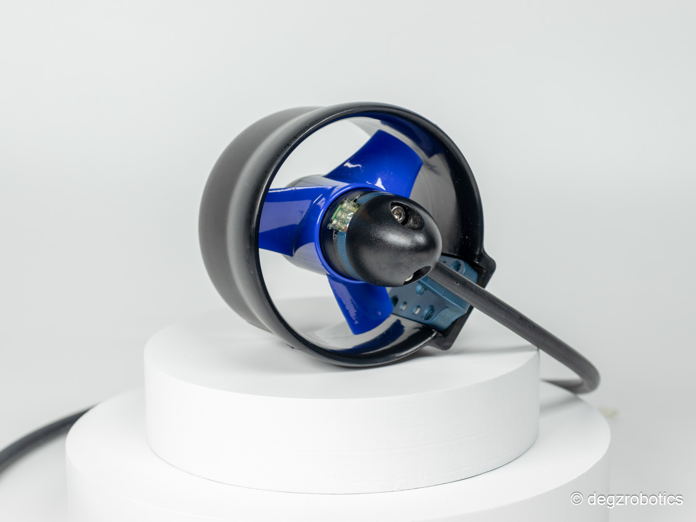
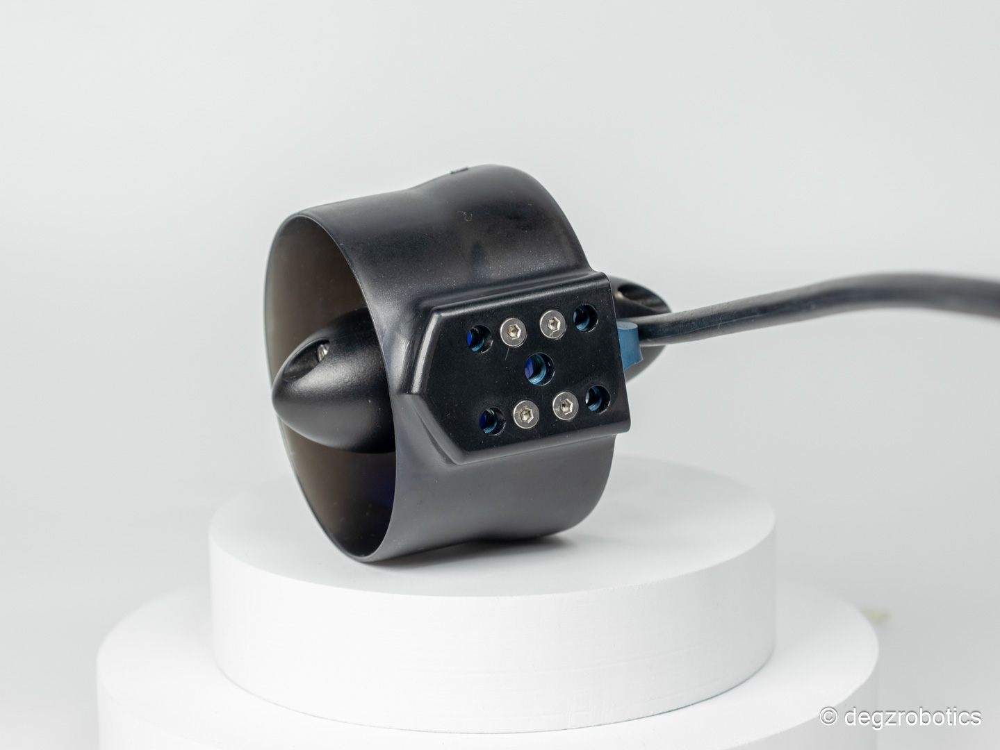

import DocCardList from '@theme/DocCardList';

# Ürün Hakkında

Yeni nesil Mitras Su Altı İticisi karşınızda!
Yüksek performans ve dayanıklılığı bir araya getiren yeni Mitras Mitras Su Altı İticisi! Enjeksiyon yöntemi ile üretilen bu iticiler, sualtında uzun ömürlü performans sunar. Küçük boyutları, yüksek gerilimi ve etkileyici itme gücü ile dikkat çeker. M1 motorundan güç alan, 3s-6s voltaj aralığında çalışabilen bu itici, 30A Degz sürücü ile önerilir.

(Yenilenen yekpare polikarbon gövde için siparişinizi şimdiden oluşturabilir, PLA gövdelerinizi 15 Ocak’ta polikarbon gövdelerle ücretsiz olarak değiştirebilirsiniz.)

Bu itici kırılmazlık garantilidir. Satın aldığınız itici sisteminin herhangi bir parçasının kırılması durumunda bize ulaşarak ücretsiz parça değişimi sağlayabilirsiniz.
Küçük boyutlar, yüksek gerilim ve yüksek itme gücü bu iticide! Enjeksiyon yöntemi ile üretilen yeni iticiler, darbelere yüksek dayanım sağlamakla birlikte, sualtında uzun ömürlü performansı vaad ediyor.

İtki Test Sonuçları için buraya tıklayın!

<DocCardList />
