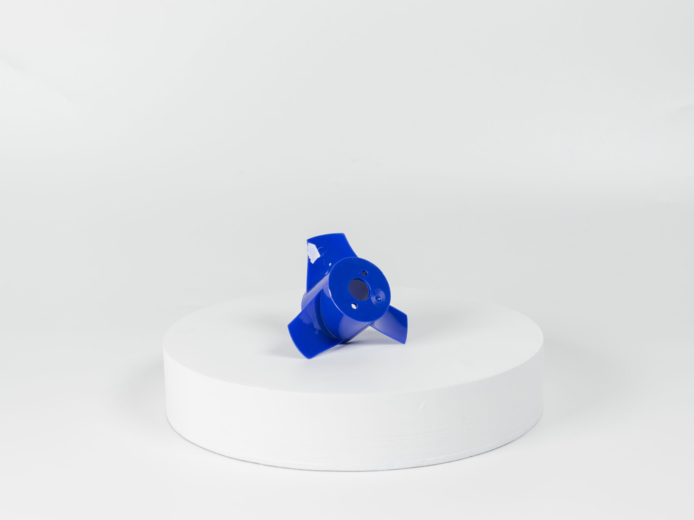
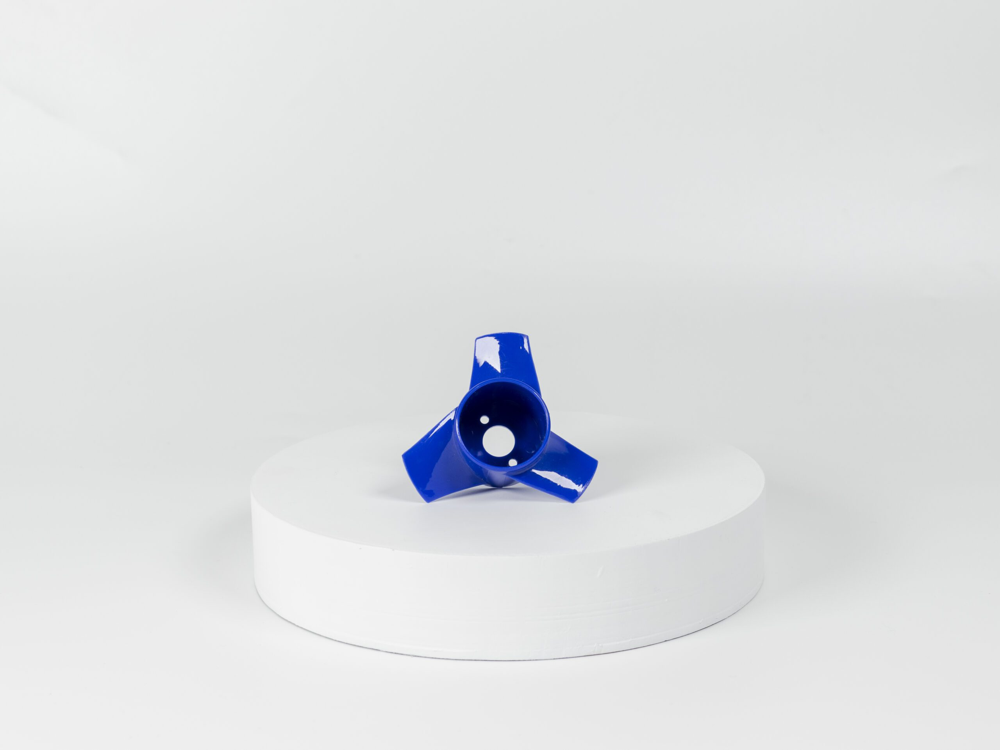

# Ürün Hakkında

**Zorlu ortamlar için yüksek güç ve yüksek dayanım bir arada!**

:::note
Bu pervane kırılmazlık garantilidir. Satın aldığınız pervanenin kırılması durumunda bize ulaşarak ücretsiz değişim sağlayabilirsiniz.
:::

Enjeksiyon kalıplama ile yüksek yoğunluklu plastik alaşımından üretilen pervaneler artık zorlu ortamda çalışmaya hazır! Mitras iticilerde kullanılan ve M1 motorlar için kullanıma uygun olan olan pervane seti, yenilenen yüksek verimli kanat profiliyle itki kuvvetini daha da artırdı. 3 boyutlu yazıcı çıktılarına göre çok yüksek dayanım gücüne sahip bu pervaneler ile artık pervanelerinizi değiştirmeye gerek kalmayacak.

Mitras Pervane
İtki: < 3.1 KG/F @ 24V (Mitras ile kullanıldığında)

Ağırlık: 10gr

## Kutu İçeriği

Her bir set için;

Bir Adet CW(Saat yönü) pervane
Bir Adet CCW(Saat yönü tersi) pervane
Ek olarak gerekebilir
Her bir set için;

2 adet M1 Motor ( 1x Pervane – 1x M1 Motor)
4 adet Montaj vidası (1x Pervane – 2x M3x4mm Vida)