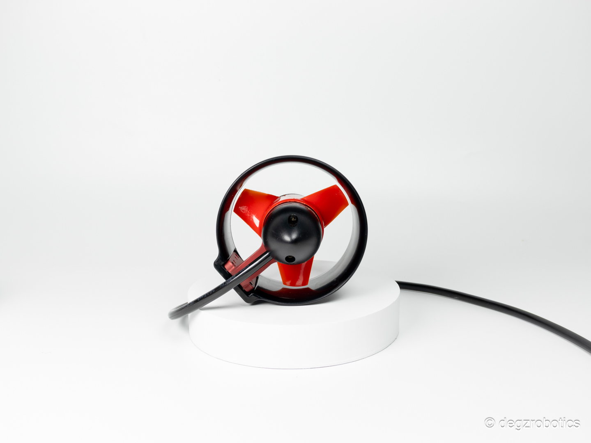
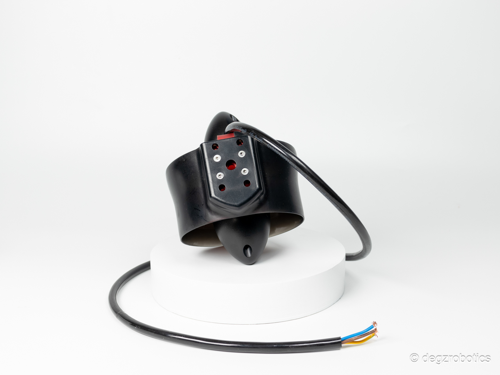

import DocCardList from '@theme/DocCardList';

# Ürün Hakkında

Şu ana kadar gördüğünüz en yüksek itme gücüne sahip itici!
Utras Su Altı İticisi, enjeksiyon yöntemiyle üretilen ve darbelere yüksek dayanım sağlayan yeni iticilerle donatılmıştır. M5 motorundan güç alan bu itici, 3s-6s voltaj aralığında çalışabilir ve 24V’de 12.4 Kgf itki kuvveti sunar. Poliüretan gövde ve pervane malzemeleri ile uzun ömürlü performansı garanti eder. Suya dayanıklı Utras, 500 metreye kadar maksimum derinlikte güvenilir bir çözümdür.

(Yenilenen yekpare polikarbon gövde için siparişinizi şimdiden oluşturabilir, PLA gövdelerinizi 4 Aralık’ta polikarbon gövdelerle ücretsiz olarak değiştirebilirsiniz.)

Bu itici kırılmazlık garantilidir. Satın aldığınız itici sisteminin herhangi bir parçasının kırılması durumunda bize ulaşarak ücretsiz parça değişimi sağlayabilirsiniz.

Yüksek itme gücü ve yüksek verimlilik arıyorsanız, Utras Su Altı İticisi sizin için! Enjeksiyon yöntemi ile üretilen yeni iticiler, darbelere yüksek dayanım sağlamakla birlikte, su altında uzun ömürlü performansı vaad ediyor.

<DocCardList />
