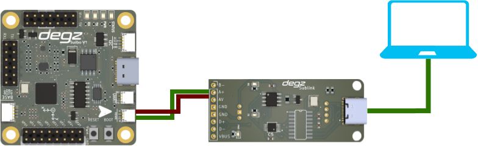

import DocCardList from '@theme/DocCardList';

# Derin Diver Setup

Before we can start using Derin Diver, we need to install Derin Diver on the Degz Suibo control board. 
Degz Suibo control board uses RP2040 microprocessor and the software installation process is done with UF2 file.

- Install CH340 drivers from [this link](https://learn.sparkfun.com/tutorials/how-to-install-ch340-drivers/all).
- Download the latest released version of Derin Diver as UF2 file from [Degzrobotics Github page](https://github.com/degzrobotics/Derin-Diver)
- Put the Degz Suibo board into bootloader mode. You can connect it to the computer via USB by pressing and holding the BOOT button or, if the board is already connected, you can also enter bootloader mode by pressing BOOT and RESET at the same time, first by removing your hand from the RESET button and then by removing your hand from the BOOT button.
- Copy the downloaded UF2 file to the drive named RPI-RP2 that your computer will recognize. After copying, the drive will disappear and you will have successfully installed Derin Diver.
- To make sure that the installation is successfully completed, you can see the opening messages of the software when you open the COM port to which the board is connected with a program that can read Serial Port such as Arduino etc. after connecting your board to the computer via USB. If you do not see any messages, you can press the RESET key and restart the board.
To communicate with Derin Diver, we need to establish our basic connection with Degz Suibo Control Board. The following shows how to make a simple connection.

By default, Derin Diver uses Degz Suibo's RS485 port for main communication. USB is used for debugging and log monitoring. After connecting Degz Suibo to Sublink, you can establish a connection via the Dive Control interface. You can learn how to connect via Dive Control here.

<DocCardList />
