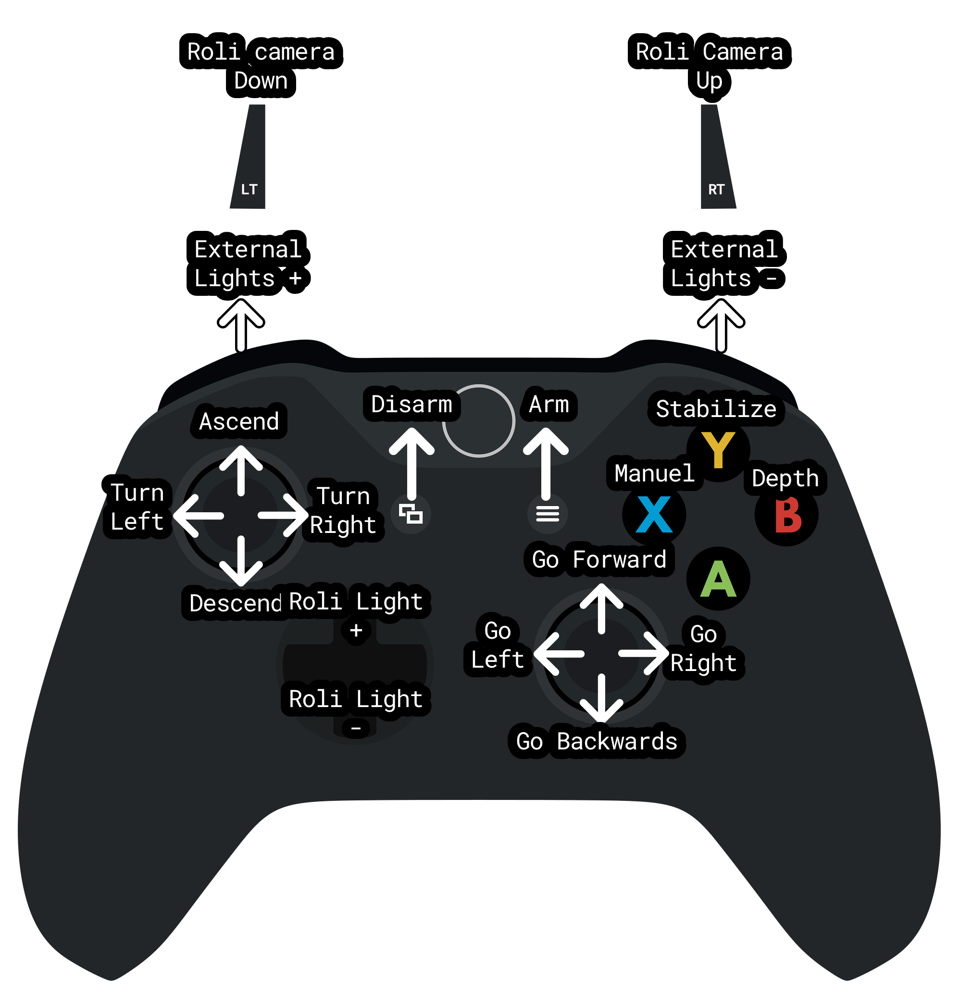

import DocCardList from '@theme/DocCardList';

# First Dive and Controls

After completing the installation and calibration steps, you can start preparing for your first dive. 
If you are sure that you have completed thruster calibrations and sensor calibrations, you are ready for your first dive!

## Things to Check Before Diving

Before putting your underwater vehicle into the water:

- Make sure you can communicate properly with your control board
- Once connected to your underwater vehicle via Dive Control, make sure you can control your thrusters and that their orientation is correct
- Check the health of your camera view. If there is interference when the thrusters are powered, you may have a problem with analog camera isolation
- If you are using a compass, make sure that it is fully calibrated, after you have powered up your underwater vehicle and your vehicle is ready for use, look at the amount of deviation of the data in the Dive Control interface. If there is a shift in the axes, there may be a problem in the calibration stages.
- Before powering up your thrusters, make sure that all propellers can rotate freely, remove anything that may prevent them from rotating.
- Make sure your reservoirs are watertight and the valve covers are closed.
- Make sure that the cable you connect to your computer from Sublink is secure. During a dive, your underwater vehicle may pull on the cable and cause the connection to break.

## Test Thrusters

When testing the thrusters, make sure you position your underwater vehicle in such a way that the propellers cannot harm you.

- Connect to your underwater vehicle via Dive Control and put your underwater vehicle in Manual Mode using your remote or keyboard.
- Press the "B" key on your remote or the "I" key on your keyboard to enter Manual Mode.
- Press "START" on the remote or "M" on the keyboard to Arm the Derin Diver.
- Give the Forward command and observe your thrusters, check that they are turning according to the thruster configuration you have chosen.
- Give the Ascend command and again observe your thrusters.
- If you have no problem with thruster movement, Disarm the Derin Diver. If there is a problem, review the thruster configuration page again.
- To Disarm the Derin Diver, press the "BACK" key on the remote or the "N" key on your keyboard.

## Controls

You can manually control your underwater vehicle via Dive Control. Keyboard or joysticks can be used as input methods. Interchangeable input system will be added in future versions.
  
### Keyboard Controls

- W - S : Up and down control, Heave
- A -D : Left and right rotation control, Heading
- Arrow keys to control forward - backward, right - left, Surge & Strafe
- M : Arm command, your vehicle will not move without arm.
- N : Disarm command, all controls are cut off.
- I : Manual control mode, no stabilization is applied to the thrusters
- O : Stabilized control mode, heading, roll and pitch stabilization applied (according to airframe type)
- P : Depth Hold control mode, stabilization is applied by fixing the depth (Under test)

### Joystick Controls

Recommended joysticks are Xbox supported joysticks. Support for other joysticks and custom joysticks will be added.

<DocCardList />
