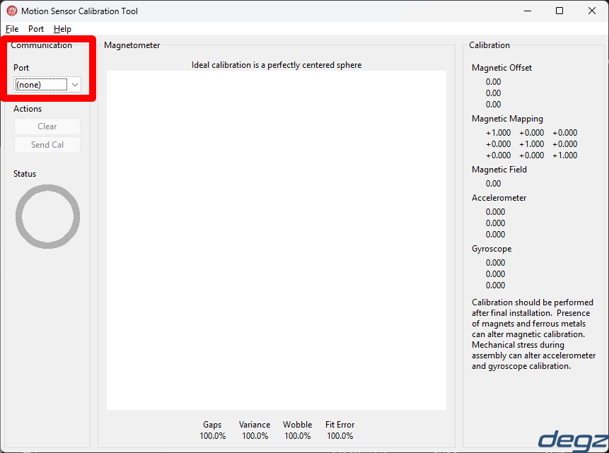
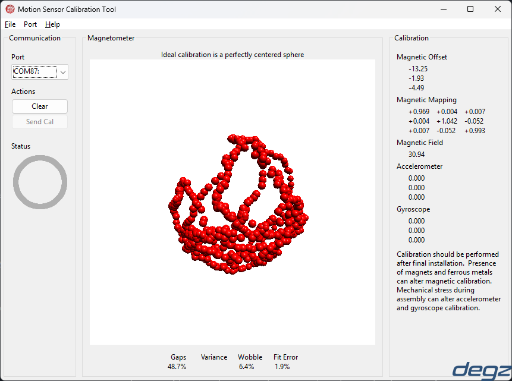
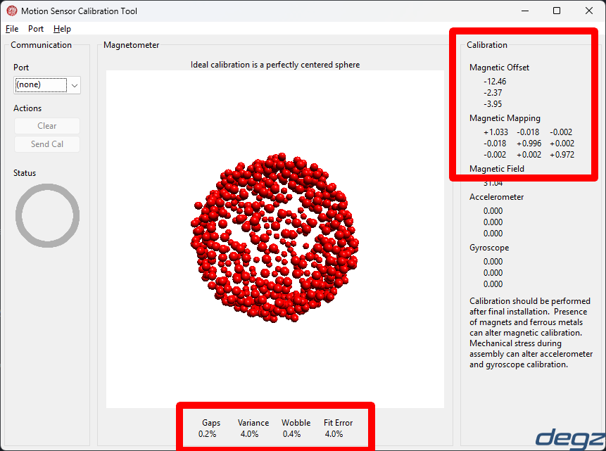
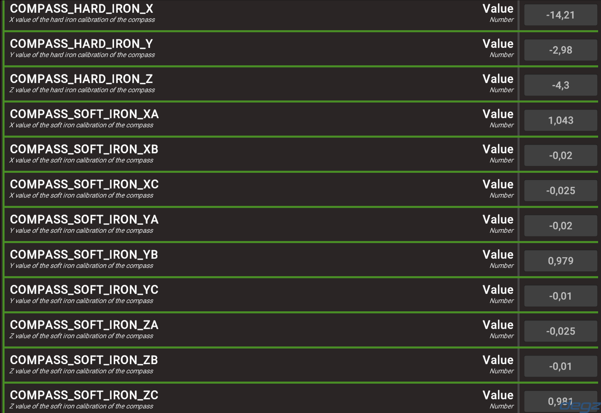
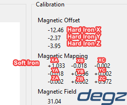

import DocCardList from '@theme/DocCardList';

# Sensor Calibration

In order for Derin Diver to operate at full performance, the sensors on the control board must be calibrated.

## Gyroscope and Accelerometer Calibration

These two sensors are calibrated when the Derin Diver is first turned on. While in calibration, make sure that the control board or your underwater vehicle is on as flat a surface as possible and does not move in any way until the calibration is finished. Incorrect data added to the calibration data may cause axis drift.

- Place the underwater vehicle or control board on a flat surface
- Power the system
- Be careful not to move the control board or your vehicle until you hear a second sound from the thrusters.

## Compass Calibration (Compass, Magnetometer)

Unlike other sensors, compass calibration must be done manually. Calibration of the compass should be done when the control board is in its final position in the vehicle to avoid axis deviation. Since the sensor used for the compass is affected by magnetic fields and ferromagnetic metals that may be around the sensor, it must be recalibrated in cases such as moving the board, adding another board next to the board. In systems using a compass, no magnet should be brought close to the control board. The constant presence of a compass too close can cause permanent damage to the sensor. The Derin Diver is calibrated for Degz Suibo by default.

### Manual Calibration

After placing our control board in its final position in the underwater vehicle, download the compassCal.uf2 file from the Derin-Diver Github Repository and install it on your control board.
To install it, just follow the normal software installation steps. Connect the board to your computer via usb by pressing BOOT and drag the compiled software file to the driver. When the drive closes you will have installed the new software.
After installing the software, [download MotionCal from here](https://www.pjrc.com/teensy/beta/imuread/MotionCal.exe). After opening the program, you will see a screen like below.

Select the COM port to which your control board is connected and start rotating your control board in each axis.
You can think of it as having an airplane in your hand.

At first you may not see anything on the screen, but after turning your control board a little left and right, the screen will look like below.

Keep rotating your control board in each axis until the Gaps at the bottom are below 2%.
If the value does not go below 2%, make sure to rotate in all axes, up and down, left and right, etc.

Once the Gaps value is below 2%, remove your control board from the computer and make a note of the data on the right to upload it to your board via Dive Control.

After reinstalling Derin Diver on your control board, open the Dive Control interface and connect to the board. Once the connection is established, pull the parameters in the vehicle and fill in the parameters for the compass calibration according to the data you received from MotionCal.

You can fill the Hard Iron parts with the data in Magnetic Offset and the Soft Iron parts by looking at the Magnetic Mapping. In Magnetic Mapping, rows are XYZ and columns are ABC. If you do as in the image, you will enter the data required for the calibration of the compass correctly.

 
After sending the parameters to the vehicle, restart your control board. Since the data required for compass calibration is set at startup, you need to restart the board.

### Calibration via Dive Control

Compass calibration via Dive Control will be added in future versions.

<DocCardList />
