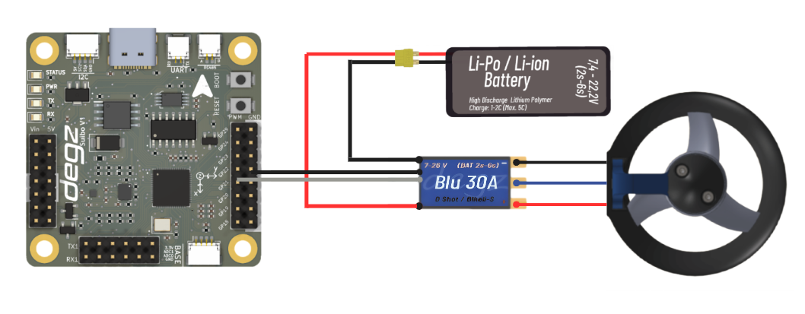

import DocCardList from '@theme/DocCardList';
import yengec6 from './image/yengec6.png';
import yengec8 from './image/yengec8.png';
import yengec6pitch from './image/yengec6pitch.png';

# Thruster Connections and Configurations

Derin Diver supports multiple thruster configurations. These configurations include Crab 6, Crab 8 and Crab 6 Pitch. For more different thruster configurations, please contact us via [Degz Robotics Forum](https://forum.degzrobotics.com).

## Supported Thruster Configurations (Derin Diver v0.9.0 and above)

Thruster configurations should take into account the directions of the motors, the directions in which they give their maximum thrust and the directions of rotation. Thrusters shown in blue should rotate clockwise and thrusters shown in orange should rotate counterclockwise. On Dive Control, you can set the pins of the thrusters with the parameters **`MOTOR_1_PIN`** and their directions with the parameters **`MOTOR_1_REVERSE`**. The images below show which motor corresponds to which number.

### Crab 6 Thruster Configuration

In the Crab 6 configuration, your underwater vehicle moves with 6 thrusters. Thrusters 1 and 2 allow the underwater vehicle to move up and down while providing stabilization in the roll axis. There is no control and stabilization in the pitch axis in this body type. Thrusters 3, 4, 5 and 6 are placed at 45-degree angles, giving the underwater vehicle the ability to move back and forth and left and right without angular rotation. This thruster configuration is the default in Derin Diver. This body type is selected when the **`FRAME_TYPE`** parameter is set to 0.

### Crab 8 Thruster Configuration

In the Crab 8 configuration, your underwater vehicle supports 8 thrusters. In this way, it gains mobility in 6 axes. When using this body type, the center of gravity and center of density of your vehicle must be precisely adjusted. When the **`FRAME_TYPE`** parameter is set to 1, this body type is selected.

### Crab 6 Pitch Thruster Configuration

It is the same as the Crab 6 configuration and allows the elevation motors to control the pitch axis instead of the roll axis. To use this configuration the **`FRAME_TYPE`** parameter must be set to 2.

## How do I know the direction of the thruster?

To understand the direction of the thrusters, you can look at the angles of the propellers.The images below show propellers rotating in two different directions. The one on the left rotates clockwise, while the one on the right rotates counterclockwise.

<DocCardList />
