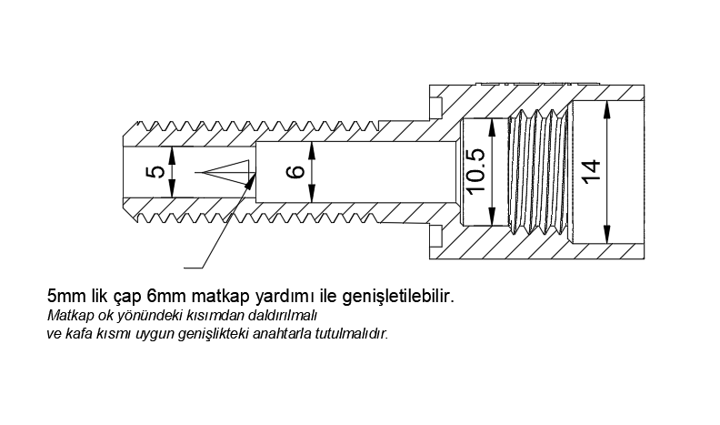

# Neo Penetrator

Degz Neo Penetrator is an innovative fastener used in underwater technology. It offers excellent sealing performance even under high pressure, allowing transferring of cables in a safe and leak-proof manner. Thanks to its reinforced structure with plastic options and epoxy application, it shows durability even in the harshest underwater conditions. Degz Neo Penetrator offers easy installation with O-ring technology and can also be used as a vacuum port, making it a versatile solution that enhances the performance of underwater vehicles.

## Penetrometer graphic drawing

This penetrometer has been meticulously designed with an inner diameter of 5mm. However, to accommodate the diverse application needs of our customers, it is possible to expand this diameter to 6mm using a drill. When performing the drilling operation, the drill should be used from the head towards the body as shown in the photographs. Moreover, securing the head of the penetrometer with a suitable wrench during the operation will facilitate your work. Please be reminded that, for safety and product performance standards, the inner diameter should not be expanded beyond 6mm.

**You can reach us through the [forum](https://forum.degzrobotics.com/) for questions and suggestions**