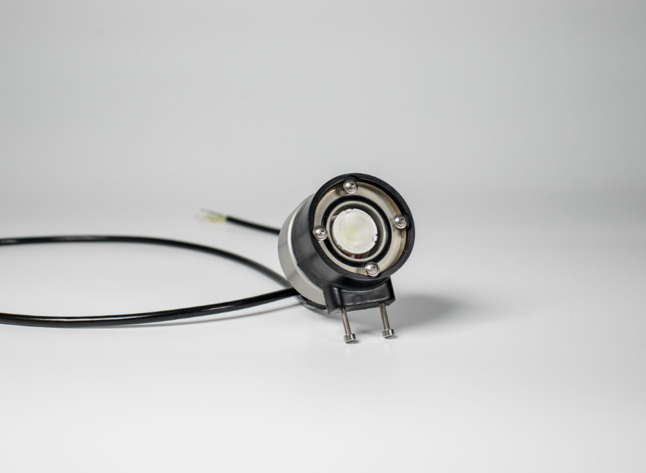

import DocCardList from '@theme/DocCardList'; 

# Underwater Illumination 1500 Lumens

This underwater lighting uses 1500 lumen Cree LEDs to provide powerful illumination and is specifically designed for underwater activities. The device has a durable body made from anodized aluminum, which ensures effective heat distribution and can be safely used up to depths of 300 meters. The lighting device is compatible with various microcontrollers such as Arduino and Raspberry Pi, and can be controlled via these boards or directly connected to the main power line. It consumes 11.2 W power, offering energy efficiency and is protected against excessive heat. With an adjustable PWM signal light intensity and a wide voltage range, this device is ideal for underwater exploration.
|      Feature          |   Description          |
|--------------------------|-----------------------|
|1500 lm light intensity|	The device offers high brightness with a power of 1500 lumens.|
|0-1500 µS Pwm Signal|	Light intensity can be adjusted with a 3.3V PWM signal within a range of 0-2000 µS.|
|15V-48V voltage range|	The device supports a wide voltage range of 15 to 48 volts.|
|Overheat protection	|Features protection against excessive heat formation for safe use.|
|Parallel connectable|	Multiple lamps can be connected in parallel to illuminate large areas.|
|Aluminum body|	The durable anodized aluminum body provides effective heat distribution and is long-lasting.|

## Pin Diagram

**You can reach us through the [forum](https://forum.degzrobotics.com/) for questions and suggestions**

<DocCardList />