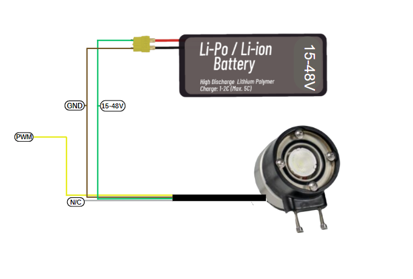

# Using the Product 

## Underwater Lighting Battery Connection Diagram

There is a simple wiring diagram for using your lighting device with four cables. The green cable represents the positive leg of the Li-Po or Li-ion battery that will power your lighting, operating between 15 and 48 volts. The brown cable creates the negative connection and grounds your lighting. The yellow cable carries pulse width modulation (PWM) used to adjust the brightness level. The white cable does not require any connection. With this simple guide, you can safely connect and use your lighting with your battery.




## Control of Underwater Lighting Brightness with Suibo

Your lighting system is powered by a Li-Po or Li-ion battery ranging from 15 to 48 volts, using a four-wire connection scheme. The green cable connects to the positive end of the battery, and the brown cable to the negative end to power the system. The yellow cable adjusts the brightness of the lighting with a PWM signal; the white cable is non-functional in this setup. Once this setup is complete, you can program with the Suibo electronic control board. For example, you can connect your lighting to pin number 23 defined as LIGHTING_PIN, and control the brightness level by sending different PWM values. This method is especially ideal for specialized applications like underwater and surface robotic projects. You can dynamically adjust the lighting needs of your robot according to environmental conditions. This flexible and controllable lighting solution allows you to use your robotic systems more effectively.


````
#define LIGHTING_PIN 23 // Pin where the lighting is connected

void setup() {
  // Set LIGHTING_PIN as output
  pinMode(LIGHTING_PIN, OUTPUT);
}

void loop() {
  // Run the lighting at low brightness (low PWM value)
  analogWrite(LIGHTING_PIN, 51); // About 20% brightness (20% of 255)
  delay(2000); // Wait for 2 seconds
  
  // Run the lighting at high brightness (high PWM value)
  analogWrite(LIGHTING_PIN, 255); // 100% brightness
  delay(2000); // Wait for 2 seconds

  // Run the lighting at medium brightness
  analogWrite(LIGHTING_PIN, 127); // About 50% brightness
  delay(2000); // Wait for 2 seconds
}
````
## Underwater Lighting Brightness Control with a Potentiometer
This code example configures and manages an LED lighting system controlled by a potentiometer using an Arduino. The code reads the analog input from a potentiometer, obtaining a value between 0 and 1023, and converts this value into a brightness level between 0 and 255. This converted value is then used to adjust the brightness of the LED. The code prints the determined brightness value to Arduino's serial monitor, providing real-time monitoring. Additionally, the code enhances functionality by adding a 10-millisecond delay, thus ensuring stable transitions between readings. This simple system serves as an illustrative example for understanding the conversion of analog signals to digital outputs and implementing hardware control with microcontrollers.


````
#define LIGHTING_PIN 23    // Pin connected to the lighting
#define POT_PIN A0         // Analog pin connected to the potentiometer

void setup() {
  pinMode(LIGHTING_PIN, OUTPUT);
  Serial.begin(9600);   // Start serial port for debugging and monitoring
}

void loop() {
  int potValue = analogRead(POT_PIN);    // Read value from potentiometer (range 0 - 1023)
  int brightness = map(potValue, 0, 1023, 0, 255); // Convert potentiometer value to brightness value (range 0 - 255)

  analogWrite(LIGHTING_PIN, brightness);    // Set the brightness of the lighting

  // Print brightness to the serial monitor
  Serial.print("Brightness: ");
  Serial.println(brightness);

  delay(10); // Add a small delay
}
````

**You can reach us through the [forum](https://forum.degzrobotics.com/) for questions and suggestions**