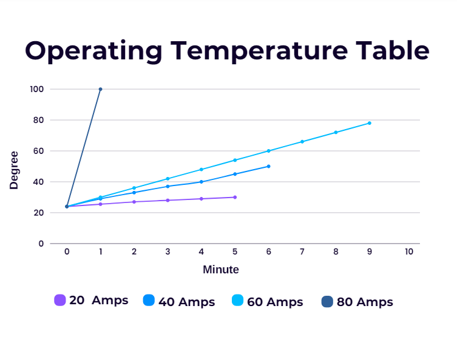

import DocCardList from '@theme/DocCardList';

# About the Product

 

Hi Base board is an electronic circuit board that allows users to monitor their energy consumption instantly. With instant current, voltage and power monitoring features, users can get a detailed view of their energy usage. Magnetic switching technology allows the board to be switched on and off without physical contact, and also offers remote controllability via an external switch. The board is equipped with an INA219 current sensor, which enables precise current measurements.  Its 45 x 45 mm compact design and wide compatibility are designed for various energy management needs, allowing them to effectively perform energy management.

## Product Technical Specifications

| Main Features | |
|--------------------------|-----------------------|
|Instant current, voltage and power monitoring allows the user to monitor energy consumption in detail.
|Magnetic switching|Allows the device to turn on and off through a magnetic field, without requiring physical contact.
|External switch|Allows users to control the device via an external switch.
|****Electrical Characteristic**|
|Maximum Current| 120 Amps (tested up to 120 amps.)
|Continuous Current| 60 Amps
|Input Voltage| 6-48 Vdc|
|Battery Types| 2s - 12s
|**Sensors**|
|INA219 Current sensor| Helps the device measure current accurately.|
|****Physical**|
|Size: 45 x 45 mm

 

## Pin Diagram

 

<DocCardList />