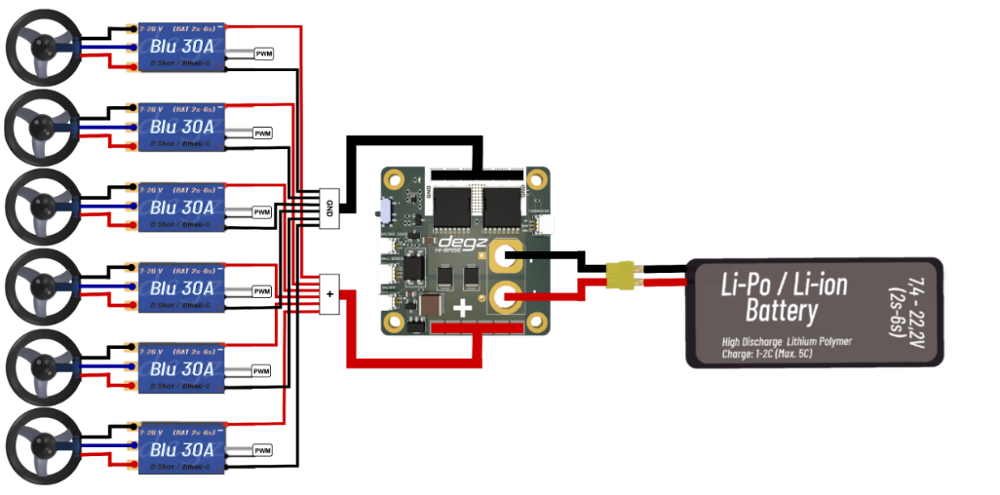
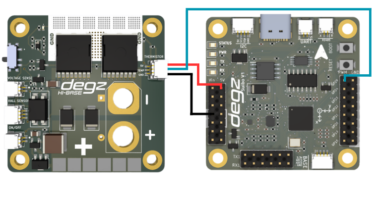

# Use of the product


## Use with Hi Base and BLU 30 A ESC Brushless Motor Driver

The usage diagram of BLU 30A ESC brushless motor driver with Hi Base card is as follows.




## Temperature Measurement with Thermistor Using Suibo and HiBase

In this example, the ambient temperature is measured using a thermistor with the Suibo Electronic Board and HiBase board. The code reads analog data from the thermistor via the analog input pins, which are commonly used in Arduino and most MCUs. The thermistor resistance is calculated using the characteristics of the thermistor and the series resistor in the circuit, and the temperature value is obtained in Kelvin, then converted to Celsius.

The code continuously prints the temperature value via the serial port. This setup is particularly suitable for laboratory environments, home automation systems, or environmental monitoring projects, as it is simple in structure, easy to implement, and provides real-time data.




````
#include <Arduino.h>

// Pin to be used for ADC reading
const int analogPin = 29 ; 

// Thermistor and circuit parameters
const float betaParameter = 3950; // Typical value, should be obtained from the thermistor datasheet
const float seriesResistance = 10000; // Value of the series resistor (in ohms)
const float referenceTemperature = 0 + 273.15; // Reference temperature (in Kelvin)
const float referenceResistance = 10000; // Reference resistance value (in ohms), thermistor resistance at 25°C

void setup() {
  Serial.begin(9600); // Start the serial port
}

void loop() {
  int readValue = analogRead(analogPin); // Read value from ADC
  float voltage = (readValue / 1023.0) * 5.0; // Convert the read value to voltage
  float thermistorResistance = (5.0 * seriesResistance / voltage) - seriesResistance; // Calculate thermistor resistance

  // Calculate the temperature
  float temperature = betaParameter / (log(thermistorResistance / referenceResistance) + (betaParameter / referenceTemperature));
  temperature = temperature - 273.15; // Convert from Kelvin to Celsius

  // Print the temperature to the serial port
  Serial.print("Temperature: ");
  Serial.print(temperature);
  Serial.println(" C");

  delay(1000); // Wait 1 second before the next reading
}
 ````

 ## Voltage Measurement Code with Suibo and HiBase 

 This code is written to obtain voltage readings from an NTC sensor using HiBase and Suibo electronic boards. The NTC sensor, connected to one of Arduino's analog pins, A0, is read at regular intervals and the obtained values are printed to the serial port. This process provides fast and continuous updates on the voltage level measured by the sensor.

During setup, serial communication is started at a higher baud rate to speed up data transmission. A one-second delay is added after each reading, ensuring a stable time interval between readings. This code can be used in voltage monitoring systems, energy management applications, or educational projects. It is an ideal solution for easy visualization and analysis of data.

````
#include <Arduino.h>

// Analog pin where the NTC sensor is connected
const int analogPin = 29;

void setup() {
  // Start serial communication
  Serial.begin(115200);
}

void loop() {
  // Read the value from the analog pin
  int sensorValue = analogRead(analogPin);
  
  // Send the read value over the serial port
  Serial.print("Sensor Value: ");
  Serial.println(sensorValue);
  
  // Wait for 1 second
  delay(1000);
}

````


**You can reach us through the [forum](https://forum.degzrobotics.com/) for questions and suggestions**