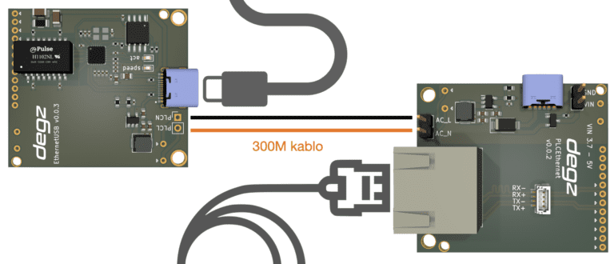

# Use of the product

## Easy to use
Sublink - Hi-com USB is ready to communicate as soon as you connect two cables (AC_L and AC_N) across each other and apply power. This simple connection simulates a standard Ethernet connection. You can connect directly from the standard ethernet outputs to any compatible device.

Sublink - Hi-com high speed module has been tested and developed on unmanned underwater vehicles. Example usage is as follows.

**You can reach us through the [forum](https://forum.degzrobotics.com/) for questions and suggestions**