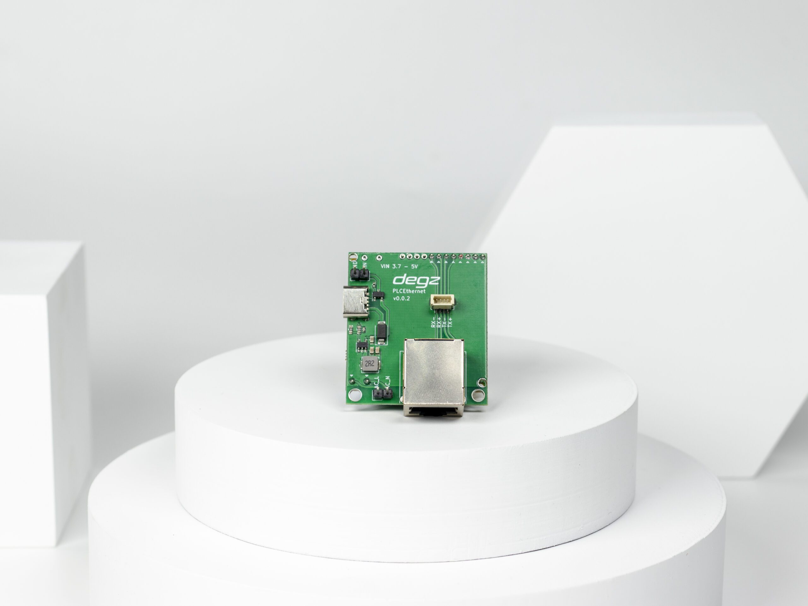

import DocCardList from '@theme/DocCardList';

# About the Product

Sublink Hi-com is a communication module designed with compact dimensions (43×38 mm) and low energy consumption. This module is capable of high-speed (200 Mbps) Ethernet communication up to 300 meters over two wires. Using the Ethernet protocol, this device can be communicated quickly and easily by connecting the AC_L and AC_N wires, offering long-term battery performance with a low power consumption of 3.3 watts per hour. Specially tested and optimized for underwater vehicles, the Sublink Hi-com has been developed to ensure reliable communication in underwater projects. The module supports standard internet protocols such as TCP/IP, IGMP, CSMA/CA, QoS and offers secure data transmission with AES 128-bit encryption.

# Product Technical Specifications

| Feature | Value |
|------------------------------------|-------------------------------|
| Range (for top speed) | 300 meters |
| Connection Speed | 200 Mbps |
| Supply Voltage | 3.7V - 5V
| USB Power Supply | Available
| Power Consumption | 3.3Watt/Hour |
| Dimensions MM (Width x Length x Height) | 43x38x32 |
| Connection Type | RJ45 or 4pin JST (Ethernet)
| Operating Temperature | 0-70 C°
| Weight | 30 grams |
| Communication Standard | IEEE 802.3 |
| Security | AES 128 Bit Encryption
| Protocol | TCP/IP, IGMP, CSMA/CA, QoS |
| Modulation Type | OFDM |
| Sublink Hi-com Usb Compatibility | Fully compatible |
| Compatibility with Sublink Lo-com | Not Compatible |

**Click here to buy this product [click here](https://degzrobotics.com/product/sublink-hi-com-yuksek-hizli-iletisim-modulu/).**  

**You can reach us through the [forum](https://forum.degzrobotics.com/) for questions and suggestions**

<DocCardList />

