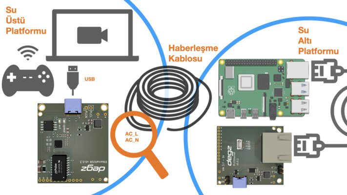

# Use of the product

The Sublink Hi-com is ready to communicate as soon as you connect two cables (AC_L and AC_N) across each other and apply power. This simple connection simulates a standard Ethernet connection. You can connect directly from the standard ethernet outputs to any compatible device.

## Only 2 cables for high speed

Sublink Hi-com communication module is a communication module developed for high speed ethernet communication over 2 cables. It can transmit the standard ethernet communication protocol over 2 cables up to a distance of 300 meters.

