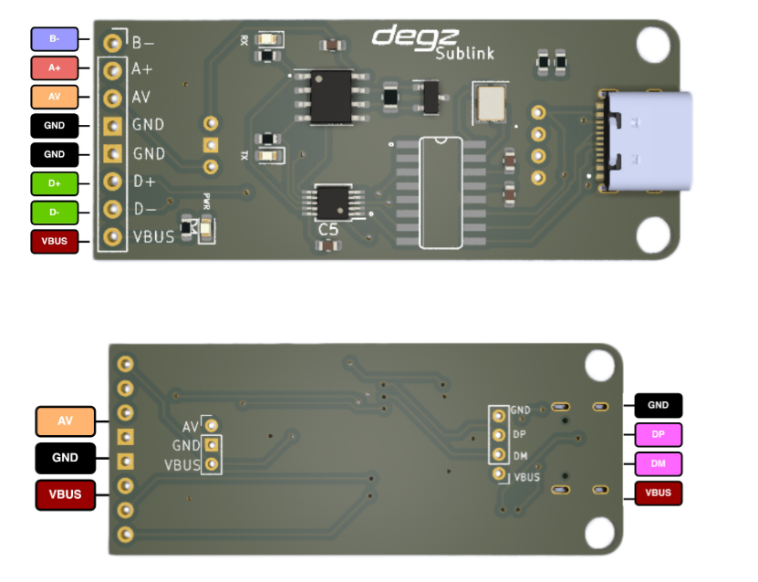
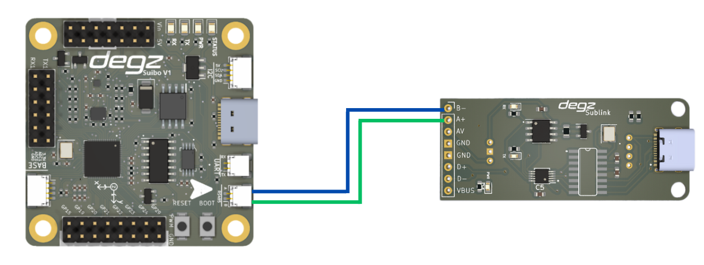

# Use of the product

## Connection diagram

## Descriptions of Pin Ports

|Pins |Features |
|------------------------------------------------|-------------------|
| TX | Transmitter pin. The module sends serial data from USB to the peripheral via this pin.
|RX | Receiver pin. The module receives serial data from the peripheral via this pin.
|AVR| This usually indicates the supply voltage of the module. It may be a voltage level used for AVR microcontrollers.
|GND | is the Ground connection and provides a common reference point for electrical circuits.|
| D+ | is the USB data plus line. It is used as a positive data line in USB data communication.| |
|D- |USB data minus line. Used as a negative data line in USB data communication.
|VBUS|USB power line and carries the 5V supply voltage through the USB connection.

## Wiring Diagram of Suibo and Sublink Cards

**You can reach us through the [forum](https://forum.degzrobotics.com/) for questions and suggestions**

