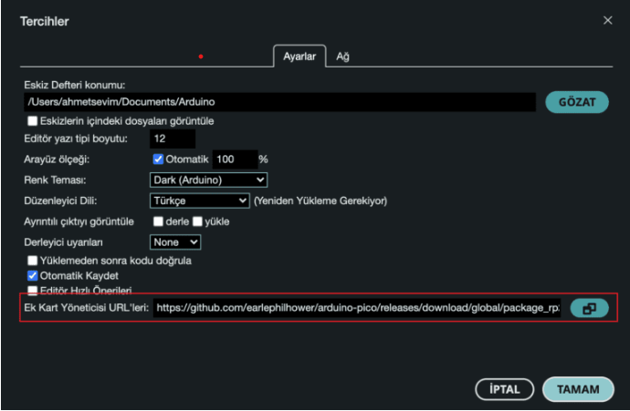
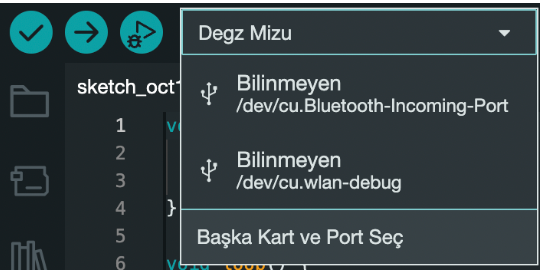

# How to Use Mizu RP2040

:::warning
This product has been removed from the production. For an alternative you can chek this [Degz Suibo](/elektronik-kartlar/Kontrol-Kartları/suibo-rp2040/)
:::

## Mizu First Time Programming with Arduino IDE

You need to follow these steps to program Mizu via Arduino IDE.

What is needed

Mizu
Type C USB Cable
Female-to-female Jumper Cable
Computer
First of all, download the Arduino IDE software [from this address](https://www.arduino.cc/en/software). Select your operating system from the Arduino IDE 2.0.0 section and download and complete the installation in the standard way.

Open Arduino IDE 2.0.0, then click on File-> Preferences and copy and paste the link below into Additional board manager URLs.

**https://github.com/earlephilhower/arduino-pico/releases/download/global/package_rp2040_index.json**

Then click on the card manager (in the left menu) and type “earle” in the search field, scroll down the text, click on Install and complete the card installation.

Then first connect Mizu's **BOOT** and **GND** pins with a female-to-female jumper cable and connect it to your computer with a Type C USB cable that you are sure has a data line. Remove the jumper cable at least 3 seconds after the LED on Mizu lights up.

After this process, Mizu will look like a USB flash drive named RPI-RP2 (or similar) on your computer.

Then, with Mizu plugged into your system, go to the card selection section and click Select Another Card and Port.

On the screen that appears, type **"Degz ”** in the search field, click on Degz Mizu (updated to Viyalab Mizu) and press **OK**.

Then open the **Led Blink** example by clicking on **File->Examples-> Basics -> Blink**. Follow the next step before installing.

Go to **Tools->Port** and select UF2 Board, then click on Load code.

 

After the installation process is finished, you will see the led on the card blinking. After this process, Mizu will appear on the card selection screen as a port named usbmodem (or similar) and the program will be ready for installation.

Unless a problem occurs, you do not need to perform the step before the one performed with the jumper cable.

**Congratulations, now you can easily use Mizu in all your projects!**

:::warning
This product has been removed from the production. For an alternative you can chek this [Degz Suibo](/elektronik-kartlar/Kontrol-Kartları/suibo-rp2040/)
:::

You can reach us through the [forum](https://forum.degzrobotics.com/) for questions and suggestions