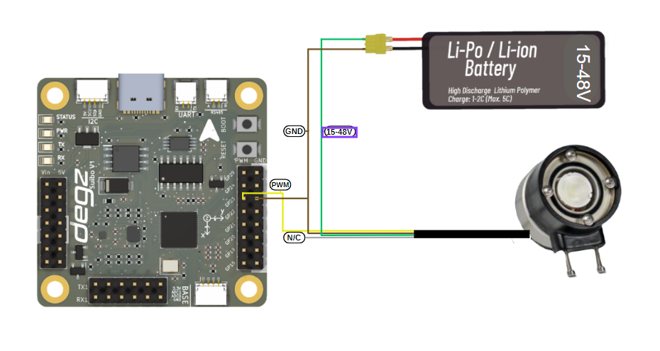

# Examples with Suibo

## Suibo QMC6310 Magnetic Sensor Data Reading Code 
This code snippet is written for the Arduino platform to read X, Y, and Z axis data from the QMC6310 magnetic sensor. The QMC6310 is a high-precision magnetometer that communicates via the I2C protocol. The following code is prepared to pull real-time three-dimensional compass data from your sensor connected to the Suibo board.

To use this code, create a new sketch in the Arduino IDE and paste the following code into the sketch. Once the code is uploaded, you can see the values representing the X, Y, and Z coordinates from the Arduino's serial port output. You can utilize these data in your projects for various applications such as navigation, positioning, or motion tracking.

If you encounter any issues while uploading the code, do not forget to check your connections and configuration settings. Happy coding!

````
#include <Wire.h>
// QMC6310 default I2C address
#define QMC06310_ADDRESS 0x6C
// Register addresses to be read for QMC6310
#define X_LSB 0x00 // X axis LSB
#define X_MSB 0x01 // X axis MSB
#define Y_LSB 0x02 // Y axis LSB
#define Y_MSB 0x03 // Y axis MSB
#define Z_LSB 0x04 // Z axis LSB
#define Z_MSB 0x05 // Z axis MSB

void setup() {
  Serial.begin(9600);
  Wire.begin(); // Initiating I2C
  // Commands to initiate the sensor can be placed here
}

void loop() {
  Wire.beginTransmission(QMC6310_ADDRESS);
  Wire.write(X_LSB); // Start reading from the first register address
  Wire.endTransmission(false); // End with a restart
  
  Wire.requestFrom(QMC6310_ADDRESS, 6); // Request 6 bytes of data, XYZ axis data
  
  if (Wire.available() == 6) {
    // Read XYZ values
    int x = Wire.read() | Wire.read() << 8;
    int y = Wire.read() | Wire.read() << 8;
    int z = Wire.read() | Wire.read() << 8;

    // Write the read values to the serial port
    Serial.print("X: ");
    Serial.print(x);
    Serial.print(" Y: ");
    Serial.print(y);
    Serial.print(" Z: ");
    Serial.println(z);
  }
  delay(1000); // Wait for 1 second
}
````
## Suibo QMC6310 Compass Data Filtering Example 
This code example applies a low-pass filter to smooth and stabilize the raw X, Y, and Z data obtained from the QMC6310 magnetic sensor. The ALPHA value determines how quickly the filtered outputs will update—a lower ALPHA value provides slower response times and smoother outputs.

The code reads the raw data from the sensor and performs continuous filtering on this data. The filtered data are displayed in real-time on the Arduino's serial monitor. This example is particularly ideal for applications such as mobile platforms and navigation systems, as these types of systems often suffer from noisy data streams.

Before starting to use the code, it is recommended to move your sensor in different directions to update the calibration values. This will help maximize the accuracy of the data.

````
#include <Wire.h>

#define QMC6310_ADDRESS 0x1C  // I2C address of the QMC6310 device
#define ALPHA 0.1              // ALPHA value for the low-pass filter

float filteredX = 0, filteredY = 0, filteredZ = 0;

void setup() {
  Serial.begin(9600);
  Wire.begin();
}

void loop() {
  int rawX, rawY, rawZ;
  readQMC6310(rawX, rawY, rawZ);

  // Calculate the filtered values
  filteredX = ALPHA * rawX + (1 - ALPHA) * filteredX;
  filteredY = ALPHA * rawY + (1 - ALPHA) * filteredY;
  filteredZ = ALPHA * rawZ + (1 - ALPHA) * filteredZ;

  // Print the filtered values to the serial monitor
  Serial.print("Filtered X: ");
  Serial.print(filteredX);
  Serial.print(" Filtered Y: ");
  Serial.print(filteredY);
  Serial.print(" Filtered Z: ");
  Serial.println(filteredZ);

  delay(200); // Longer delay between readings
}

void readQMC6310(int &x, int &y, int &z) {
  Wire.beginTransmission(QMC6310_ADDRESS);
  Wire.write(0x00);
  Wire.endTransmission(false);
  Wire.requestFrom(QMC6310_ADDRESS, 6);
  if (Wire.available() == 6) {
    x = Wire.read() | Wire.read() << 8;
    y = Wire.read() | Wire.read() << 8;
    z = Wire.read() | Wire.read() << 8;
  }
}
````
**Advanced Compass Data Filtering Techniques**

This guide includes various advanced filtering techniques to enhance the stability and reliability of the data obtained from the QMC6310 magnetic sensor. To make your data readings more accurate, you can implement the following steps:

1) Calibration: Rotate your sensor in different directions to determine the lowest and highest values and update these values in your code as the relevant OFFSET variables.
2) Filtering: Apply a heavier filter by reducing the ALPHA value to decrease data fluctuations.
Environmental Control: Conduct your tests in non-magnetic environments to reduce magnetic noise.
3) Timing: Reduce the frequency of data readings to extend delay times.
4) Additional Filtering Methods: Refine your data further using methods such as moving average, median filter, and Kalman filter.
   
These steps will ensure the compass data used in your project are more accurate and useful.

## Suibo LSM6DS3 Accelerometer and Gyroscope Data Reading Code

This code example is prepared to read accelerometer and gyroscope data from the LSM6DS3 sensor. The code connects the sensor to Arduino via the I2C communication protocol and continuously measures acceleration and rotation speeds on the X, Y, and Z axes.

During the setup phase, the sensor is initialized, and if the initialization fails, the process is halted. After a successful start, the accelerometer and gyroscope data from the sensor are printed in detail to the serial monitor. Each data point is displayed with precision up to three decimal places, which facilitates the analysis of the data.

This code can be used in various projects such as motion tracking, position detection, or robotic applications. A one-second delay between each reading ensures the data can be easily observed.

````
#include "SparkFunLSM6DS3.h"
#include "Wire.h" // For I2C protocol

// Creates an object for the LSM6DS3 sensor. Sets the I2C communication mode and the sensor's I2C address.
LSM6DS3 myIMU(I2C_MODE, 0x6A);

void setup() {
  // Initiates serial communication. Used for data exchange between the computer and the microcontroller.
  Serial.begin(9600);
  delay(1000); // Adds a 1-second delay at the start.
  Serial.println("Processor exited reset.\n"); // Prints a message to the serial monitor.

  // Initializes the sensor. If unsuccessful, the setup function stops.
  myIMU.begin();
}

void loop() {
  // Prints accelerometer data to the serial monitor.
  Serial.print("\nAccelerometer:\n");
  Serial.print(" X = ");
  Serial.println(myIMU.readFloatAccelX(), 3); // Reads and prints the X axis accelerometer data.
  Serial.print(" Y = ");
  Serial.println(myIMU.readFloatAccelY(), 3); // Reads and prints the Y axis accelerometer data.
  Serial.print(" Z = ");
  Serial.println(myIMU.readFloatAccelZ(), 3); // Reads and prints the Z axis accelerometer data.

  // Prints gyroscope data to the serial monitor.
  Serial.print("\nGyroscope:\n");
  Serial.print(" X = ");
  Serial.println(myIMU.readFloatGyroX(), 3); // Reads and prints the X axis gyroscope data.
  Serial.print(" Y = ");
  Serial.println(myIMU.readFloatGyroY(), 3); // Reads and prints the Y axis gyroscope data.
  Serial.print(" Z = ");
  Serial.println(myIMU.readFloatGyroZ(), 3); // Reads and prints the Z axis gyroscope data.

  delay(1000); // Adds a 1-second delay between readings.
}
````


## Suibo LSM6DS3 Temperature Data Reading Code

This code example uses the built-in thermometer feature of the LSM6DS3 sensor module to read and display the ambient temperature in Celsius and Fahrenheit. The code configures your sensor to communicate with Arduino via the I2C communication protocol and checks whether the sensor is properly initialized at the start.

After a successful initialization, temperature readings are taken from the sensor, and these values are printed to the serial monitor with precision up to four decimal places. This allows for detailed observation of temperature fluctuations.

The code is particularly suitable for environmental monitoring, weather stations, or other temperature-related automation projects. A one-second delay between each reading prevents device overload while ensuring a continuous flow of data.

````
#include "SparkFunLSM6DS3.h"
#include "Wire.h" // Library required for I2C protocol

// We are creating an object for the LSM6DS3 sensor. We specify the I2C mode and the sensor's I2C address.
LSM6DS3 myIMU(I2C_MODE, 0x6A);

void setup() {
  // We start the serial connection. This allows us to exchange data between the computer and the microcontroller.
  Serial.begin(9600);
  delay(1000); // We wait a bit at the start to let the system settle.
  Serial.println("Processor exited reset.\n"); // We print a message indicating that the processor has exited reset.

  // We initiate the sensor. This process checks if the sensor is working correctly.
  myIMU.begin();
}

void loop() {
  // We print the thermometer readings to the serial port.
  Serial.print("\nThermometer:\n");
  Serial.print(" Degrees C = "); // We print the temperature value in Celsius.
  Serial.println(myIMU.readTempC(), 4); // We read and print the Celsius temperature value from the sensor with four decimal precision.
  Serial.print(" Degrees F = "); // We print the temperature value in Fahrenheit.
  Serial.println(myIMU.readTempF(), 4); // We read and print the Fahrenheit temperature value from the sensor with four decimal precision.

  delay(1000); // We wait one second between each temperature reading.
}
````


## Automatic Heating Control System with Suibo Electronic Board

In this project, the Suibo Electronic Board is used to monitor indoor temperatures and automatically activate the heater in cold weather conditions. The LSM6DS3 sensor measures the ambient temperature and processes this data through an Arduino. In this system, an integrated PID control mechanism with the QuickPID library regulates the heater's temperature to maintain the desired comfort level.

The heater is controlled by the PID algorithm to reach a set value (Setpoint). Thus, the temperature is automatically adjusted to the user's set ideal temperature. This automatic control of the system is ideal for home automation systems, greenhouses, or other projects requiring environmental monitoring. Additionally, continuous data printing through the Arduino serial port allows for instant monitoring of temperature changes.

The code leverages the diversity and compatibility advantages provided by the Suibo board, offering developers a wide range of application possibilities. This structure is easily implementable and can be customized according to project needs. With this system, users can enhance energy efficiency and make living spaces more comfortable by providing automatic temperature control in cold weather conditions.

````
#include <Arduino.h>  // Includes the basic Arduino library.
#include <Wire.h>     // Includes the library for I2C protocol.
#include "SparkFunLSM6DS3.h" // Includes the SparkFun LSM6DS3 library.
#include "QuickPID.h"  // Includes the QuickPID library.

LSM6DS3 imu = LSM6DS3(I2C_MODE, 0x6A); // Initializes the LSM6DS3 sensor for I2C communication.

float Setpoint, Input, Output; // Defines variables for PID control.

float Kp = 70, Ki = 1.6, Kd = 1.7; // Sets PID control parameters.

QuickPID heaterPid(&Input, &Output, &Setpoint); // Creates a PID control object.

void setup() {
  Wire.begin(); // Starts the I2C communication.
  imu.begin(); // Initializes the IMU sensor.
  heaterPid.SetTunings(Kp, Ki, Kd); // Sets the PID parameters.
  heaterPid.SetMode(QuickPID::Control::automatic); // Sets the PID control mode to automatic.
  pinMode(26, OUTPUT); // Sets pin 26 as an output.
  Setpoint = 45; // Sets the target temperature.
}

void loop() {
  Input = imu.readTempC(); // Reads the temperature from the sensor and assigns it to Input.
  heaterPid.Compute(); // Performs the PID computation.
  analogWrite(26, Output); // Writes the Output value to pin 26 as an analog signal.
  Serial.println("|Pid Out: " + String(Output) + "|Temp: " + String(imu.readTempC()) + "|"); // Prints the output and temperature values to the serial port.
}

````


## Temperature Measurement with Thermistor Using Suibo and HiBase

In this example, the ambient temperature is measured using a thermistor with the Suibo Electronic Board and HiBase board. The code reads analog data from the thermistor via the analog input pins, which are commonly used in Arduino and most MCUs. The thermistor resistance is calculated using the characteristics of the thermistor and the series resistor in the circuit, and the temperature value is obtained in Kelvin, then converted to Celsius.

The code continuously prints the temperature value via the serial port. This setup is particularly suitable for laboratory environments, home automation systems, or environmental monitoring projects, as it is simple in structure, easy to implement, and provides real-time data.


````
#include <Arduino.h>

// Pin to be used for ADC reading
const int analogPin = 29 ; 

// Thermistor and circuit parameters
const float betaParameter = 3950; // Typical value, should be obtained from the thermistor datasheet
const float seriesResistance = 10000; // Value of the series resistor (in ohms)
const float referenceTemperature = 0 + 273.15; // Reference temperature (in Kelvin)
const float referenceResistance = 10000; // Reference resistance value (in ohms), thermistor resistance at 25°C

void setup() {
  Serial.begin(9600); // Start the serial port
}

void loop() {
  int readValue = analogRead(analogPin); // Read value from ADC
  float voltage = (readValue / 1023.0) * 5.0; // Convert the read value to voltage
  float thermistorResistance = (5.0 * seriesResistance / voltage) - seriesResistance; // Calculate thermistor resistance

  // Calculate the temperature
  float temperature = betaParameter / (log(thermistorResistance / referenceResistance) + (betaParameter / referenceTemperature));
  temperature = temperature - 273.15; // Convert from Kelvin to Celsius

  // Print the temperature to the serial port
  Serial.print("Temperature: ");
  Serial.print(temperature);
  Serial.println(" C");

  delay(1000); // Wait 1 second before the next reading
}
 ````

 ## Voltage Measurement Code with Suibo and HiBase 

 This code is written to obtain voltage readings from an NTC sensor using HiBase and Suibo electronic boards. The NTC sensor, connected to one of Arduino's analog pins, A0, is read at regular intervals and the obtained values are printed to the serial port. This process provides fast and continuous updates on the voltage level measured by the sensor.

During setup, serial communication is started at a higher baud rate to speed up data transmission. A one-second delay is added after each reading, ensuring a stable time interval between readings. This code can be used in voltage monitoring systems, energy management applications, or educational projects. It is an ideal solution for easy visualization and analysis of data.

````
#include <Arduino.h>

// Analog pin where the NTC sensor is connected
const int analogPin = 29;

void setup() {
  // Start serial communication
  Serial.begin(115200);
}

void loop() {
  // Read the value from the analog pin
  int sensorValue = analogRead(analogPin);
  
  // Send the read value over the serial port
  Serial.print("Sensor Value: ");
  Serial.println(sensorValue);
  
  // Wait for 1 second
  delay(1000);
}

````


## D300 Pressure, Temperature, Depth, and Altitude Sensor Data Reading Code

This code uses the Arduino and the D300 Depth and Water Temperature Sensor (MS5837 model) to measure pressure, temperature, depth, and altitude in underwater environments. The MS5837 sensor accurately measures the physical properties of water and transmits the data via the Arduino's serial port.

During setup, serial communication is initiated at 9600 baud, and the I2C connection is established. The sensor's initialization checks for any connection errors. Once successfully initialized, the sensor model and water density are configured, preparing it for measurements.

In the main loop, the sensor is continuously read, and the obtained pressure, temperature, depth, and altitude values are printed to the serial port. A one-second delay is added after each reading to maintain a consistent data flow. This code is ideal for underwater research, diving technologies, maritime applications, or environmental monitoring projects. The continuous and reliable recording of data is crucial for analysis and monitoring activities.


````
#include <Wire.h>
#include "MS5837.h"

MS5837 sensor;

void setup() {
  Serial.begin(9600); // Start serial communication at 9600 baud.
  
  Serial.println("Starting"); // Send start message through serial port.
  
  Wire.begin(); // Start I2C connection.

  // Initializing sensor. If it fails, print error message.
  while (!sensor.init()) {
    Serial.println("Initialization failed!"); // Initialization failed.
    Serial.println("Are SDA/SCL correctly connected?"); // Check if SDA/SCL are correctly connected.
    Serial.println("Degz Robotics Bar30: Yellow=SDA, Green=SCL"); // Correct information: Yellow=SDA, Green=SCL
    Serial.println("\n\n\n"); // Add extra blank lines.
    delay(5000); // Wait for 5 seconds.
  }
  
  sensor.setModel(MS5837::MS5837_30BA); // Set sensor model.
  sensor.setFluidDensity(997); // Set fluid density (997 kg/m^3 for freshwater, 1029 for seawater).
}

void loop() {
  // Update pressure and temperature readings.
  sensor.read();

  // Print pressure information to serial port.
  Serial.print("Pressure: "); 
  Serial.print(sensor.pressure()); 
  Serial.println(" mbar");
  
  // Print temperature information to serial port.
  Serial.print("Temperature: "); 
  Serial.print(sensor.temperature()); 
  Serial.println(" degrees C");
  
  // Print depth information to serial port.
  Serial.print("Depth: "); 
  Serial.print(sensor.depth()); 
  Serial.println(" m");
  
  // Print altitude information to serial port.
  Serial.print("Altitude: "); 
  Serial.print(sensor.altitude()); 
  Serial.println(" m above sea level");

  delay(1000); // Wait for 1 second.
}
````

## Control of Underwater Lighting Brightness with Suibo

Your lighting system is powered by a Li-Po or Li-ion battery ranging from 15 to 48 volts, using a four-wire connection scheme. The green cable connects to the positive end of the battery, and the brown cable to the negative end to power the system. The yellow cable adjusts the brightness of the lighting with a PWM signal; the white cable is non-functional in this setup. Once this setup is complete, you can program with the Suibo electronic control board. For example, you can connect your lighting to pin number 23 defined as LIGHTING_PIN, and control the brightness level by sending different PWM values. This method is especially ideal for specialized applications like underwater and surface robotic projects. You can dynamically adjust the lighting needs of your robot according to environmental conditions. This flexible and controllable lighting solution allows you to use your robotic systems more effectively.




````
#define LIGHTING_PIN 23 // Pin where the lighting is connected

void setup() {
  // Set LIGHTING_PIN as output
  pinMode(LIGHTING_PIN, OUTPUT);
}

void loop() {
  // Run the lighting at low brightness (low PWM value)
  analogWrite(LIGHTING_PIN, 51); // About 20% brightness (20% of 255)
  delay(2000); // Wait for 2 seconds
  
  // Run the lighting at high brightness (high PWM value)
  analogWrite(LIGHTING_PIN, 255); // 100% brightness
  delay(2000); // Wait for 2 seconds

  // Run the lighting at medium brightness
  analogWrite(LIGHTING_PIN, 127); // About 50% brightness
  delay(2000); // Wait for 2 seconds
}
````
## Underwater Lighting Brightness Control with a Potentiometer
This code example configures and manages an LED lighting system controlled by a potentiometer using an Arduino. The code reads the analog input from a potentiometer, obtaining a value between 0 and 1023, and converts this value into a brightness level between 0 and 255. This converted value is then used to adjust the brightness of the LED. The code prints the determined brightness value to Arduino's serial monitor, providing real-time monitoring. Additionally, the code enhances functionality by adding a 10-millisecond delay, thus ensuring stable transitions between readings. This simple system serves as an illustrative example for understanding the conversion of analog signals to digital outputs and implementing hardware control with microcontrollers.


````
#define LIGHTING_PIN 23    // Pin connected to the lighting
#define POT_PIN A0         // Analog pin connected to the potentiometer

void setup() {
  pinMode(LIGHTING_PIN, OUTPUT);
  Serial.begin(9600);   // Start serial port for debugging and monitoring
}

void loop() {
  int potValue = analogRead(POT_PIN);    // Read value from potentiometer (range 0 - 1023)
  int brightness = map(potValue, 0, 1023, 0, 255); // Convert potentiometer value to brightness value (range 0 - 255)

  analogWrite(LIGHTING_PIN, brightness);    // Set the brightness of the lighting

  // Print brightness to the serial monitor
  Serial.print("Brightness: ");
  Serial.println(brightness);

  delay(10); // Add a small delay
}
````

**You can reach us through the [forum](https://forum.degzrobotics.com/) for questions and suggestions**