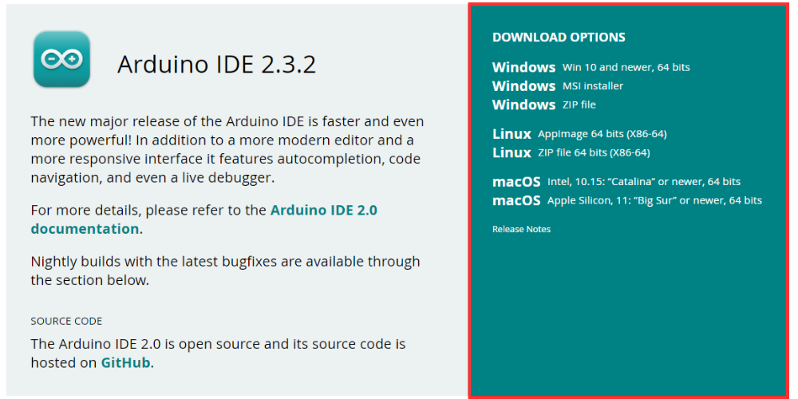
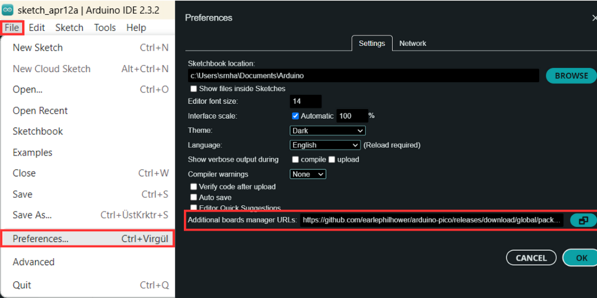
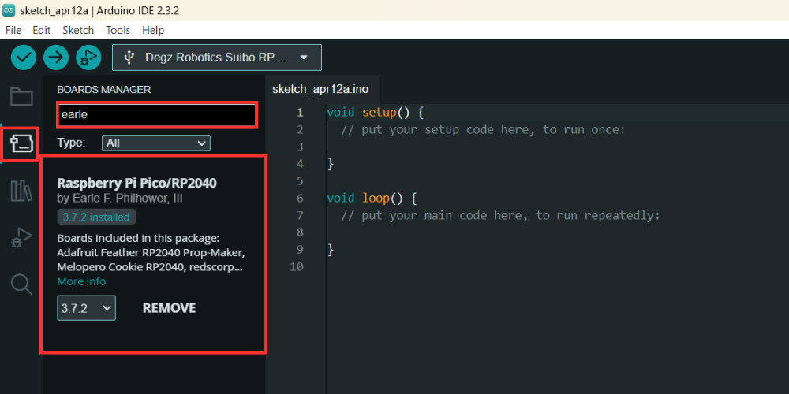
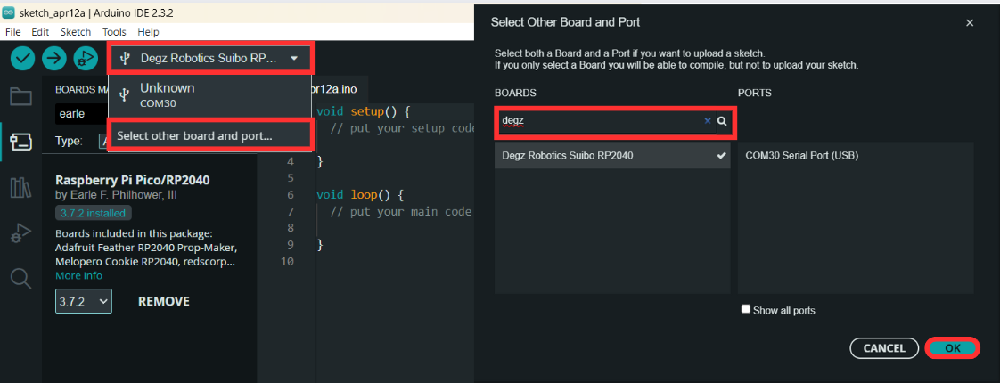
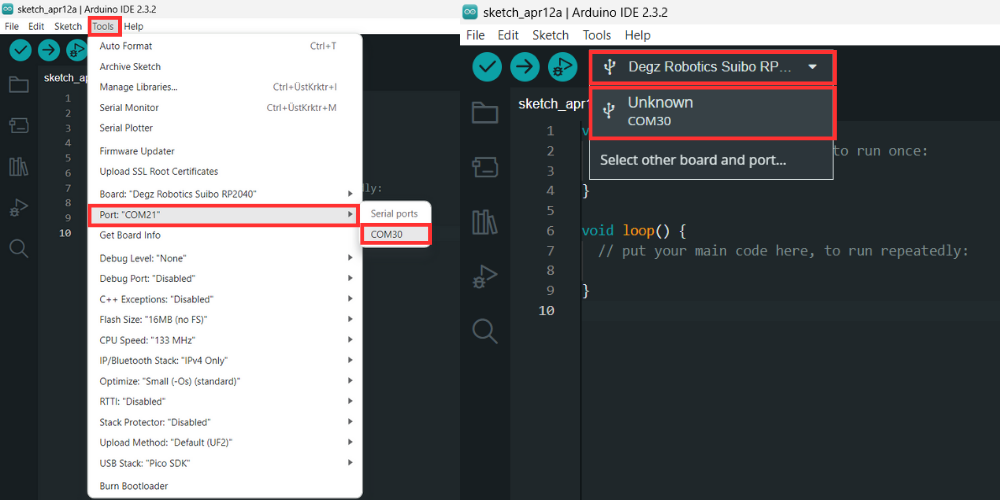
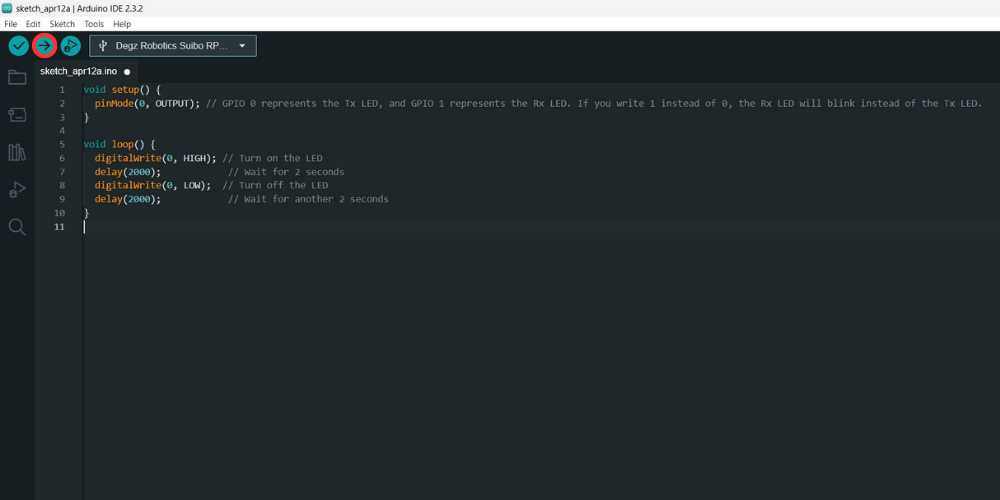

# Use of the product

##  Suibo – First Time Programming with Arduino IDE

 ### Step 1: Starting Out
Before you start programming Suibo, you will need a few basic materials: a Suibo device, a Type C USB cable, and a computer. These items form the foundation of the programming process.

 ### Step 2: Installing Arduino IDE
 

First, download the Arduino IDE 2.3.2 software by [clicking on this link](https://www.arduino.cc/en/software). Choose the version appropriate for your operating system, download the software, and install it on your computer. The installation generally involves a few simple steps and does not require any special configuration.

### Step 3: Software Configuration


After installing the Arduino IDE, open the program and go to the File menu and select Preferences. In the 'Additional Board Manager URLs' section, paste this URL: https://github.com/earlephilhower/arduino-pico/releases/download/global/package_rp2040_index.json. This action ensures that the Arduino IDE is compatible with Suibo.

### Step 4: Setting Up the Board


Next, access the Board Manager within the Arduino IDE and type "earle" into the search bar to find the relevant board. Select the necessary board from the options that appear and complete the installation. This step allows the IDE to recognize Suibo and perform programming tasks.

### Step 5: Programming


First, connect Suibo to your computer using a Type C USB cable. While connected, go to the card selection screen in the Arduino IDE and select the first option that appears when you type 'Degz', which should be Degz Robotics Suibo Rp2040. Then, to test the board, copy the following code snippet onto the main screen.
````
void setup() {
  pinMode(0, OUTPUT); // GPIO 0 represents the Tx LED, and GPIO 1 represents the Rx LED. If you write 1 instead of 0, the Rx LED will blink instead of the Tx LED.
}

void loop() {
  digitalWrite(0, HIGH); // Turn on the LED
  delay(2000);            // Wait for 2 seconds
  digitalWrite(0, LOW);  // Turn off the LED
  delay(2000);            // Wait for another 2 seconds
}
````
:::note
"The status LED does not light up on v1 Suibo boards."
:::


### Step 6: Uploading and Testing the Code



Next, from the Tools menu, select the port by choosing UF2 Board, and press the upload button to load the program onto Suibo. If the program is successfully uploaded, the GP0 will blink the TX LED and if GP1 is mentioned, the RX LED will blink.
These steps summarize the general process you should follow to program Suibo. Once the programming is complete, Suibo is ready to be used in your projects.




**You can reach us through the [forum](https://forum.degzrobotics.com/) for questions and suggestions**

