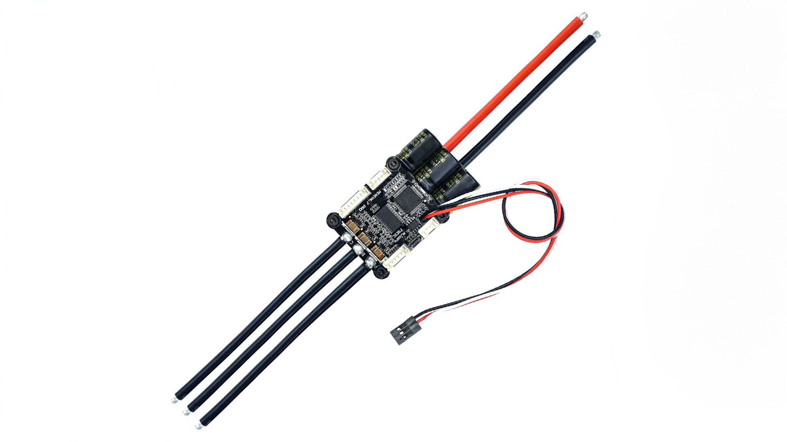

import DocCardList from '@theme/DocCardList';

# VESC 6.7 70A High Power Motor Driver - Flipsky

The VESC motor driver is an open source motor controller that can operate over a wide voltage range from 14V to 60V and can provide a maximum current of 70A continuous and 200A instantaneous. This motor drive supports various control modes such as DC, BLDC and FOC (sinusoidal) and can provide energy recovery with regenerative braking. It is compatible with many ports such as USB, CAN and UART and sensors such as ABI, HALL, AS5047. With its programmable structure and VESC Tool software, users can customize motor drives according to their needs. It also has protection functions for low and high voltage, over current and high temperature. With dimensions of 67x39x18.7mm, this motor drive offers a flexible and safe solution for various applications.

# Product Technical Specifications

:::warning
Since VESC operates with high voltage up to 60V, it must be used with care!
:::

## About the Board

| Feature | Value |
|----------------------------|--------------------------------------------------------------------------------------------------------------------------------------------------------------------------------------------------------------------------------------------|
| Continuous current | 100A
| Instantaneous current | 200A
| Voltage | 14V-60V (Cells: 4-13S; safe for 4S to 12S, voltage - spikes must not exceed 60V!) |
| BEC | 5V @ 1A ERPM: 150000 Control |
| Interface Ports | USB, CAN, UART
| Supported Sensors | ABI, HALL, AS5047, AS5048A
| Input Set Support | PPM, ADC, NRF, UART, SPI, IIC Modes: DC, BLDC, FOC - (sinusoidal)
| Regenerative capacity | Yes |
| Programmable | Yes |
| Motor cable | 10AWG
| Power cable | 8AWG
| Size | 75.4×63.7×31.1mm (including heat sink)
| Features | Four Control Modes: Current / Duty Cycle / Speed / Position - control mode. |
| Protection functions: undervoltage protection, overvoltage protection, over-current protection, over-temperature protection, over-temperature protection of MOSFETs. Supports accelerometer measurement unit modules such as MPU9250, MPU9150, MPU6050, LSM6DS3, BMI160. |

:::info
It is recommended to use the factory firmware version 5.2, new firmware update may damage the ESC.
:::

## Comprehensive Driver Tuning Software VESC Tool

You can easily program your motor driver with VESC interface.
You can use [this link](https://vesc-project.com/vesc_tool) to download the programmer.

**To buy this product [click here](https://degzrobotics.com/product/vesc-6-6-70a-yuksek-guclu-motor-surucu-flipsky/).** 

**You can reach us through the [forum](https://forum.degzrobotics.com/) for questions and suggestions**

<DocCardList />
